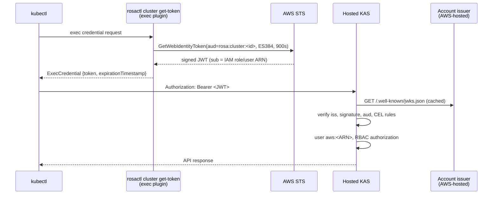
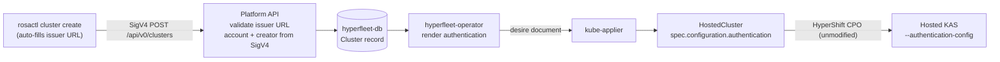

# AWS IAM Authentication for Hosted Clusters

**Last Updated Date**: 2026-10-02

## Summary

Customers log in to their hosted cluster's kube-apiserver (KAS) with their existing AWS credentials. A `kubectl` exec plugin requests a short-lived JWT from AWS STS (`sts:GetWebIdentityToken`, IAM outbound identity federation), and the KAS validates it with its built-in structured JWT authenticator, configured through the existing HostedCluster API (`spec.configuration.authentication.type: OIDC`). The cluster creator is `cluster-admin` on day 1; all other access is granted with in-cluster RBAC. No HyperShift changes, no signing keys held by us, and no new infrastructure.

## Context

- **Problem Statement**: Hosted clusters need user-facing authentication. The only access method today is the `system:admin` client certificate kubeconfig extracted from the management cluster. Customers need to log in with the same AWS IAM identities they use for the Platform API, and the cluster creator needs admin access on day 1 to bootstrap everyone else.

- **Constraints**:
  - AWS IAM is the only identity source. No separate identity systems.
  - No central failure point: a Platform API or regional outage must not block cluster logins.
  - Use the existing HyperShift HostedCluster API. No HyperShift fork and no KAS modifications.
  - The KAS token webhook (`--authentication-token-webhook-config-file`) is a single slot that OpenShift owns. We must not take it.
  - Management clusters are multi-tenant. Tenant-supplied values must not let a tenant reach the management cluster network, and one tenant's credentials must never authenticate to another tenant's cluster.

- **Assumptions**:
  - Customers enable IAM outbound identity federation in their AWS account once (`aws iam enable-outbound-web-identity-federation`). This gives the account a unique, AWS-hosted issuer URL of the form `https://<id>.tokens.sts.global.api.aws`.
  - Principals that log in have `sts:GetWebIdentityToken`.
  - The hosted cluster's OpenShift release enables `ExternalOIDCWithUpstreamParity` (CEL claim mappings and validation rules) in the `Default` feature set. The control-plane operator in `5.0.0-ec.6` does not and silently drops the creator mapping; `5.0.0-rc.5` is used instead. The management cluster's HyperShift operator must also install a HostedCluster CRD with these fields (HyperShift `main` from 2026-07-07 or later).

## Architecture

### Login Flow



The Platform API and the regional cluster are not in the login path. Tokens are cached by the exec plugin until shortly before expiry.

### Provisioning Flow



1. **rosactl** looks up the account's issuer URL with `iam:GetOutboundWebIdentityFederationInfo` and sends it as `spec.awsIAMLoginIssuerURL`. Terraform and raw API clients set the field directly.
2. **Platform API** validates the issuer URL (see [Security](#security)) and checks that the caller can be made cluster-admin (an IAM role or IAM user). The account ID (`accountId`) and creator (`creatorARN`) are the existing service-set fields taken from the SigV4 caller, never from the request body.
3. **hyperfleet-operator** renders `spec.configuration.authentication` on the HostedCluster from the issuer URL, account ID and creator ARN, validating each value again before it is interpolated into CEL.
4. **HyperShift**, unmodified, turns it into the KAS `--authentication-config` structured authentication configuration.

### Rendered HostedCluster Configuration

Example for cluster `3f6c2d1e-…` in account `111122223333`, created by a session of role `PlatformAdmins`:

```yaml
spec:
  configuration:
    authentication:
      type: OIDC
      oidcProviders:
        - name: aws-iam
          issuer:
            issuerURL: https://a1b2c3d4-….tokens.sts.global.api.aws
            audiences: ["rosa:cluster:3f6c2d1e-…"]
          oidcClients: []
          claimMappings:
            username:
              claim: sub
              prefixPolicy: Prefix
              prefix:
                prefixString: "aws:"
            groups:
              # The cluster creator is cluster-admin.
              expression: "claims.sub.startsWith('arn:aws:iam::111122223333:role/') && claims.sub.endsWith('/PlatformAdmins') ? ['system:cluster-admins'] : []"
          claimValidationRules:
            - type: CEL
              cel:
                expression: "claims['https://sts.amazonaws.com/'].aws_account == '111122223333'"
                message: token is from a different AWS account
```

The configuration is written only by the service, so it stays minimal: trust (issuer, audience), naming (`aws:` + `sub`), the creator's admin group, and the account rule. Token lifetime is enforced by STS and, optionally, customer IAM policies (`sts:DurationSeconds`).

### Access Model

- **Day 1**: the creator is always mapped to the `system:cluster-admins` group, which OpenShift binds to `cluster-admin`.
- **Day 2 and later**: all other access is ordinary in-cluster RBAC on the username `aws:<sub>`, managed by the cluster's admins (directly or through GitOps). The service never changes the authentication configuration to grant access.

```sh
oc create clusterrolebinding developers-view --clusterrole=view \
  --user='aws:arn:aws:iam::111122223333:role/Developers'
oc create rolebinding team-a-edit -n team-a --clusterrole=edit \
  --user='aws:arn:aws:iam::111122223333:role/TeamA'
```

`sub` is the IAM role ARN (including any path), not the assumed-role session ARN, so everyone who assumes a role shares one Kubernetes identity. `oc whoami` prints the exact username to bind.

## Implementation

### Stored State

Nothing new outside the existing Cluster record. No S3 bucket, no keys, no per-account table. AWS hosts the issuer's discovery document and signing keys.

| Cluster spec field     | Source                     | Notes                                                                           |
| ---------------------- | -------------------------- | ------------------------------------------------------------------------------- |
| `awsIAMLoginIssuerURL` | Create request             | New. The only new API field. Immutable, validated against the allowlist.        |
| `accountId`            | SigV4 (`X-Amz-Account-Id`) | Existing, service-set. Validated `^\d{12}$` before being interpolated into CEL. |
| `creatorARN`           | `X-Amz-Caller-Arn`         | Existing, service-set. Normalised by the operator when rendering (see below).   |

### Creator Normalisation

API Gateway reports role sessions as `arn:aws:sts::<acct>:assumed-role/<Name>/<session>`, but STS tokens carry `sub = arn:aws:iam::<acct>:role/[<path>/]<Name>`. IAM role names are unique within an account regardless of path, so the creator is matched with `claims.sub.startsWith('arn:<partition>:iam::<acct>:role/') && claims.sub.endsWith('/<Name>')`. IAM users (`arn:aws:iam::<acct>:user/...`) are matched exactly. Root and federated-user callers are rejected at create time, so the error is synchronous. The validation and matching rules live in the shared `api/iamauth` package so the Platform API and the operator cannot drift apart.

### Exec Plugin and Kubeconfig

`rosactl cluster get-token --cluster-id <id>` calls `GetWebIdentityToken` with audience `rosa:cluster:<id>`, `ES384` and a 900-second lifetime, and prints a `client.authentication.k8s.io/v1` `ExecCredential` that expires 60 seconds before the token, so `kubectl` requests a new one in time. `rosactl cluster kubeconfig` writes:

```yaml
users:
  - name: my-cluster-aws
    user:
      exec:
        apiVersion: client.authentication.k8s.io/v1
        command: rosactl
        args: [cluster, get-token, --cluster-id, <cluster-id>]
        interactiveMode: Never
```

### Customer Prerequisites

1. Enable outbound identity federation once per AWS account.
2. Grant `sts:GetWebIdentityToken` to principals that log in. Customers can scope which clusters each principal may log in to:

```json
{
  "Version": "2012-10-17",
  "Statement": [
    {
      "Effect": "Allow",
      "Action": "sts:GetWebIdentityToken",
      "Resource": "*",
      "Condition": {
        "ForAllValues:StringEquals": {
          "sts:IdentityTokenAudience": ["rosa:cluster:<cluster-id>"]
        },
        "NumericLessThanEquals": { "sts:DurationSeconds": 900 },
        "StringEquals": { "sts:SigningAlgorithm": "ES384" }
      }
    }
  ]
}
```

### Changes by Repository

| Repository            | Area                                                       | Change                                                                                                  |
| --------------------- | ---------------------------------------------------------- | ------------------------------------------------------------------------------------------------------- |
| `rosa-hyperfleet-api` | `api/v1alpha1/cluster_types.go`, `api/iamauth/`            | `awsIAMLoginIssuerURL` field; shared issuer, account and creator validation                             |
| `rosa-hyperfleet-api` | `platform-api/pkg/handlers/cluster.go`                     | Reject non-STS issuers and creators that cannot be cluster-admin at create time                         |
| `rosa-hyperfleet-api` | `hyperfleet-operator/internal/render/`                     | Render `spec.configuration.authentication`; remove `aws-iam-auth-config` ConfigMap and annotation       |
| `rosa-hyperfleet-cli` | `internal/commands/cluster/`, `internal/services/cluster/` | `get-token` via `GetWebIdentityToken`; issuer lookup on `create`                                        |
| `rosa-hyperfleet`     | `argocd/config/management-cluster/hypershift/values.yaml`  | Revert to the upstream HyperShift image                                                                 |
| `rosa-hyperfleet`     | Network egress                                             | Allow HTTPS from MCs (and the Platform API, for the create-time check) to `*.tokens.sts.global.api.aws` |
| `hypershift`          | —                                                          | None                                                                                                    |

## Alternatives Considered

1. **`aws-iam-authenticator` KAS sidecar (previous experimental design)**: Customers sent presigned `sts:GetCallerIdentity` URLs, which a sidecar validated through the KAS token webhook, mapping ARNs from a synced ConfigMap. Discarded because it required modifying the KAS token webhook (`--authentication-token-webhook-config-file`). That webhook has a single slot, which OpenShift uses for its integrated OAuth server and which future OCP authentication plans depend on, so redirecting it to our sidecar would collide with them. It also required a forked HyperShift build (sidecar injection, ConfigMap sync, webhook redirect) and mapped the creator to `system:masters`, which bypasses authorization and cannot be revoked through RBAC.
2. **HyperFleet token-exchange service**: The Platform API accepts SigV4 requests and mints JWTs signed with our own key, trusted by every hosted cluster. Rejected because it makes us a signing authority whose key compromise affects every cluster in a region, and puts the regional service in the login path.
3. **Issuer registration with proof of possession**: Customers prove ownership of the issuer URL with a signed STS token before it is accepted. Rejected as unnecessary: the host allowlist guarantees the issuer is AWS, and the CEL `aws_account` rule guarantees only the creating account's principals authenticate. A wrong URL only breaks logins to the customer's own cluster.

## Design Rationale

- **Justification**: STS outbound identity federation produces standard OIDC JWTs signed by AWS, which the KAS validates natively through the structured authentication configuration that HyperShift already exposes on the HostedCluster. This meets every constraint: AWS IAM identities, no HyperShift fork, no use of the token webhook slot, no keys held by us, and no regional dependency in the login path.
- **Evidence**:
  - AWS documents per-account issuer URLs, `sub` set to the IAM principal ARN, account and organization claims under `https://sts.amazonaws.com/`, and IAM condition keys for audience, duration and signing algorithm ([IAM outbound identity federation](https://docs.aws.amazon.com/IAM/latest/UserGuide/id_roles_providers_outbound.html), [token claims](https://docs.aws.amazon.com/IAM/latest/UserGuide/id_roles_providers_outbound_token_claims.html)).
  - HyperShift's CPO renders `OIDCProviders`, including CEL username, groups, extra and validation rules, into the KAS `--authentication-config` (`control-plane-operator/controllers/hostedcontrolplane/v2/kas/auth.go`) and validates CEL at admission (`support/validations/authentication.go`).
- **Comparison**: Unlike the sidecar, this uses only supported HostedCluster API surface and leaves the token webhook to OpenShift. Unlike a token-exchange service, AWS remains the only signer and the regional services are not in the login path.

## Consequences

### Positive

- No HyperShift fork. Management clusters run upstream HyperShift.
- No signing keys, OIDC hosting or new storage on our side.
- Logins keep working during Platform API or regional outages.
- Access is managed with standard Kubernetes RBAC and works with customers' GitOps tooling.
- The creator gets `cluster-admin` through RBAC instead of `system:masters`, so all requests remain subject to authorization and audit.
- Customers can scope who may log in to which cluster with IAM policies (`sts:IdentityTokenAudience`).

### Negative

- The `oidcProviders` list allows one entry (`MaxItems=1`), so AWS IAM occupies the only slot. Customers cannot add their own IdP (Entra ID, Okta) alongside it until openshift/api raises the limit.
- Customers must enable outbound identity federation in their account, an extra onboarding step compared with `sts:GetCallerIdentity`.
- Principals assuming the same role share one Kubernetes identity; audit logs show the role, not the person.
- Each cluster trusts one account's issuer. Principals from other accounts must assume a role in the cluster's account.
- A wrong issuer URL is only detected at first login unless the create-time JWKS check catches it.

## Cross-Cutting Concerns

### Reliability

- **Scalability**: Token validation happens in each hosted KAS with cached keys. There is no per-request call to AWS or to our services.
- **Observability**: Alert on KAS JWT authenticator failures and JWKS fetch errors per hosted control plane.
- **Resiliency**: The issuer endpoint is an external dependency for key refresh only. Already-cached keys keep validating tokens during short issuer outages. The Platform API is not in the login path, and the SRE break-glass client certificate path is unaffected.

### Security

- **Tenant isolation**: Each AWS account has its own issuer and signing keys. The CEL rule `aws_account == '<SigV4 account>'` is the control that binds the cluster to the creating account; it must never be removed, and it has dedicated unit and e2e tests.
- **Cluster isolation within an account**: The audience `rosa:cluster:<id>` makes tokens valid for one cluster only. Cluster IDs must never be reused.
- **SSRF**: The KAS fetches keys from the issuer URL inside the management cluster network. The Platform API only accepts `^https://[a-z0-9-]+\.tokens\.sts\.global\.api\.aws$` (plus partition-specific hosts when added), enforced again by CRD validation.
- **Privilege mapping**: The only group the configuration ever emits is `system:cluster-admins`, and only for an exact match on the service-controlled creator `sub`. Groups are never derived from `request_tags` (caller-controlled) or `principal_tags` (overridable by session tags).
- **Identity namespace**: Usernames are always prefixed `aws:`, so they can never collide with `system:` users.
- **Token lifetime and revocation**: `rosactl` requests tokens valid for at most 15 minutes, and customers can cap the lifetime with `sts:DurationSeconds`. Tokens cannot be revoked individually; customers stop new tokens immediately with an IAM deny or by disabling federation.
- **CEL injection**: Every value interpolated into CEL (account ID, partition, role name, user ARN) is restricted to characters that need no escaping in a CEL string.
- **Intra-account authentication**: Any principal in the account that can mint tokens can authenticate, but without RBAC bindings it only has `system:authenticated` permissions. Customers restrict minting per cluster with IAM policies.

### Performance

- Validation is local to the KAS (signature check plus CEL evaluation). The exec plugin caches tokens for up to 15 minutes, so `kubectl` does not call STS on every request.

### Cost

- No new AWS resources. `GetWebIdentityToken` calls are made from customer accounts.

### Operability

- Removes the custom HyperShift image and its rebase burden.
- The authentication configuration does not change after create; access changes are RBAC only.
- Network egress to `*.tokens.sts.global.api.aws` must be allowed from management clusters.

## Open Questions

- Is `GetWebIdentityToken` available in AWS GovCloud, and what is the issuer host there (FedRAMP)?
- Does an account's issuer URL change if federation is disabled and re-enabled? If so, existing clusters need an update path.
- Does a change to `spec.configuration.authentication` roll the KAS?
- Confirm the `cluster-admins` ClusterRoleBinding to `system:cluster-admins` exists on current hosted cluster releases.

## Related Documentation

- [IAM outbound identity federation](https://docs.aws.amazon.com/IAM/latest/UserGuide/id_roles_providers_outbound.html)
- [Kubernetes structured authentication configuration](https://kubernetes.io/docs/reference/access-authn-authz/authentication/#using-authentication-configuration)
- [kube-applier Resource Distribution](kube-applier-architecture.md)
- [Regional OIDC Ownership](regional-oidc-ownership.md) (service-account issuer; unrelated to user login)
