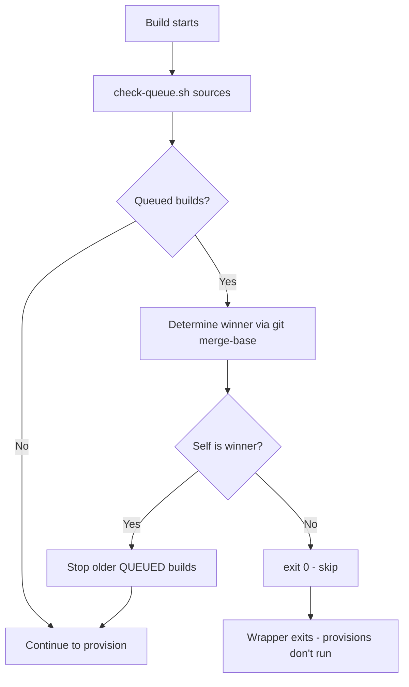

# Check Queue Skip Logic

**Parent ADR:** [codebuild-optimization.md](codebuild-optimization.md) (step 3: check-queue.sh)  
**Last Updated:** 2026-09-28

## Summary

The `check-queue.sh` script prevents stale commits from running expensive terraform applies when newer commits are queued. When a build starts, it checks if a newer git commit is queued for the same project. If yes, it stops older queued builds and exits cleanly (skip), letting only the newest commit proceed to terraform apply.

**Time savings:** 30-90 minutes per stale commit skipped.

## The Problem

**Scenario:** Developer pushes commits A → B → C rapidly.

**Without check-queue.sh:**

- CodeBuild queues 3 builds with `concurrentBuildLimit: 1`
- Build A applies commit A (30-90 min)
- Build B applies commit B (30-90 min, **wasted** — C is latest)
- Build C applies commit C (30-90 min)
- **Total: 90-270 minutes**

**With check-queue.sh:**

- Build A applies commit A (30-90 min)
- Build B sees C queued (newer), exits in <1 min (skip)
- Build C applies commit C (30-90 min)
- **Total: 60-180 minutes** (30-90 min saved)

## Implementation

### Flow



### Winner Selection Algorithm

**Goal:** Among self + queued builds, pick the newest commit.

```bash
# 1. Try git ancestry (git merge-base --is-ancestor)
if git merge-base --is-ancestor NEWEST_SHA self_sha; then
    # NEWEST_SHA is ancestor of self_sha → self is newer
    NEWEST_SHA=self_sha
fi

# 2. Fallback: buildNumber (if ancestry unavailable, e.g., shallow clone)
if ancestry check fails; then
    if self_buildNumber > NEWEST_BUILD_NUM; then
        # Higher buildNumber = newer
        NEWEST_SHA=self_sha
    fi
fi
```

**Why two methods?**

- **Git ancestry:** Accurate for related commits (A→B→C linear history)
- **BuildNumber fallback:** Works when shallow clone breaks ancestry (CodeBuild default depth=1)

**Edge cases:**

- Unrelated commits (different branches): buildNumber decides
- Only self queued: self is winner (no-op)
- Self already IN_PROGRESS: never stopped (only QUEUED builds stoppable)

## Critical: Source vs. Execute

**Why `source` instead of execute:**

Buildspecs run each command in a **new shell**. If check-queue.sh is executed as `./check-queue.sh`, its `exit 0` only ends that subprocess — the buildspec continues to the next command.

**Solution:**

```yaml
# buildspec-combined.yml calls wrapper
commands:
  - ./scripts/buildspec/provision-cluster.sh regional-cluster
```

```bash
# provision-cluster.sh sources check-queue.sh
source scripts/pipeline-common/check-queue.sh  # exit 0 kills THIS shell
./scripts/buildspec/provision-infra-rc.sh      # never runs if check-queue exited
```

When check-queue.sh does `exit 0`, it terminates the wrapper script, preventing provision scripts from running.

## Safety Guarantees

1. **Only stops QUEUED builds** — never interrupts IN_PROGRESS (terraform mid-apply is safe)
2. **Self ARN scoping** — IAM policy only allows `StopBuild` on self project ARN
3. **Idempotent** — safe to run multiple times (no-op if already winner)
4. **Fail-open** — if check-queue.sh errors, build continues (doesn't block)

## Troubleshooting

**Build keeps retrying stale SHA:**

- Check buildspec `on-failure: RETRY-1` is set (not higher — CodeBuild would restart skipped build)
- Verify check-queue.sh is sourced (not executed)

**All builds skipping:**

- Check `ListBuildsForProject` IAM permission
- Verify `CODEBUILD_RESOLVED_SOURCE_VERSION` env var is set

**Builds stop mid-apply:**

- Check-queue.sh only stops QUEUED builds — if happening mid-apply, different cause (check CodeBuild logs)

## Related Documentation

- [codebuild-optimization.md](codebuild-optimization.md) — Parent ADR
- [provision-cluster.sh](../../scripts/buildspec/provision-cluster.sh) — Wrapper implementation
- [check-queue.sh](../../scripts/pipeline-common/check-queue.sh) — Skip logic implementation
