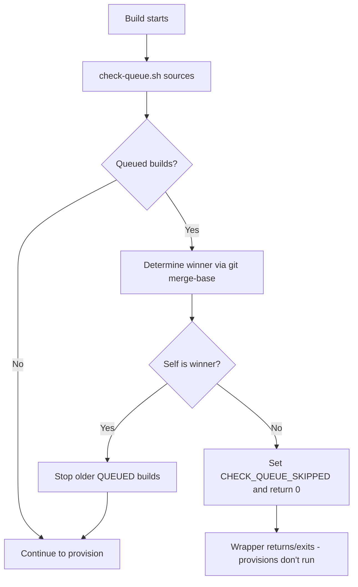

# Check Queue Skip Logic

**Parent ADR:** [codebuild-optimization.md](codebuild-optimization.md) (step 3: check-queue.sh)  
**Last Updated:** 2026-10-02

## Summary

The `check-queue.sh` script prevents stale commits from running expensive terraform applies when newer commits are queued. When a build starts, it checks if a newer git commit is queued for the same project. If yes, it stops older queued builds, sets `CHECK_QUEUE_SKIPPED=true`, and returns cleanly. The wrapper then stops before Terraform, letting only the newest commit proceed.

**Time savings:** 30-90 minutes per stale commit skipped.

## The Problem

**Scenario:** Developer pushes commits A → B → C rapidly.

**Without check-queue.sh:**

- CodeBuild queues 3 builds with `concurrentBuildLimit: 1`
- Build A applies commit A (30-90 min)
- Build B applies commit B (30-90 min, **wasted** — C is latest)
- Build C applies commit C (30-90 min)
- **Total: 90-270 minutes**

**With check-queue.sh:**

- Build A applies commit A (30-90 min)
- Build B sees C queued (newer), exits in <1 min (skip)
- Build C applies commit C (30-90 min)
- **Total: 60-180 minutes** (30-90 min saved)

## Implementation

### Flow



### Winner Selection Algorithm

**Goal:** Among self + queued builds, pick the newest commit.

```bash
# 1. Try git ancestry (git merge-base --is-ancestor)
if git merge-base --is-ancestor NEWEST_SHA self_sha; then
    # NEWEST_SHA is ancestor of self_sha → self is newer
    NEWEST_SHA=self_sha
fi

# 2. Fallback: buildNumber (if ancestry unavailable, e.g., shallow clone)
if ancestry check fails; then
    if self_buildNumber > NEWEST_BUILD_NUM; then
        # Higher buildNumber = newer
        NEWEST_SHA=self_sha
    fi
fi
```

**Why two methods?**

- **Git ancestry:** Accurate for related commits (A→B→C linear history)
- **BuildNumber fallback:** Works when shallow clone breaks ancestry (CodeBuild default depth=1)

**Edge cases:**

- Unrelated commits (different branches): buildNumber decides
- Only self queued: self is winner (no-op)
- Self already IN_PROGRESS: never stopped (only QUEUED builds stoppable)

## Critical: Source vs. Execute

**Why `source` instead of execute:**

The wrapper must source `check-queue.sh` so the `CHECK_QUEUE_SKIPPED` flag is visible to the wrapper. The wrapper then returns when it is sourced by CodeBuild, or exits when it is executed directly. The CodeBuild buildspec also sources the wrapper so `APPLIED` and `APPLIED_SHA` remain in the shell whose environment CodeBuild exports.

**Solution:**

```yaml
# buildspec-combined.yml sources wrapper and verifies the success contract
commands:
  - |
    source ./scripts/buildspec/provision-cluster.sh regional-cluster
    if [[ "${CHECK_QUEUE_SKIPPED:-false}" != "true" ]]; then
      test "${APPLIED:-}" = "true"
      test "${APPLIED_SHA:-}" = "${CODEBUILD_RESOLVED_SOURCE_VERSION}"
    fi
```

```bash
# provision-cluster.sh sources check-queue.sh
source scripts/pipeline-common/check-queue.sh
if [ "${CHECK_QUEUE_SKIPPED:-false}" = "true" ]; then
    return 0  # or exit 0 when the wrapper is executed directly
fi
./scripts/buildspec/provision-infra-rc.sh      # never runs for a stale build
```

When a build is stale, `check-queue.sh` returns after setting the skip flag. The wrapper handles the return and prevents provision scripts from running without terminating the parent CodeBuild shell.

## Safety Guarantees

1. **Only stops QUEUED builds** — never interrupts IN_PROGRESS (terraform mid-apply is safe)
2. **Self ARN scoping** — IAM policy only allows `StopBuild` on self project ARN
3. **Idempotent** — safe to run multiple times (no-op if already winner)
4. **Fail-open** — if check-queue.sh errors, build continues (doesn't block)

## Troubleshooting

**Build keeps retrying stale SHA:**

- Verify the wrapper is sourced and the buildspec checks `CHECK_QUEUE_SKIPPED`.
- RC may retry one failed build phase; MC uses `ABORT` so a registration/readiness failure does not rerun the entire MC apply.

**All builds skipping:**

- Check `ListBuildsForProject` IAM permission
- Verify `CODEBUILD_RESOLVED_SOURCE_VERSION` env var is set

**Builds stop mid-apply:**

- Check-queue.sh only stops QUEUED builds — if happening mid-apply, different cause (check CodeBuild logs)

## Related Documentation

- [codebuild-optimization.md](codebuild-optimization.md) — Parent ADR
- [provision-cluster.sh](../../scripts/buildspec/provision-cluster.sh) — Wrapper implementation
- [check-queue.sh](../../scripts/pipeline-common/check-queue.sh) — Skip logic implementation
