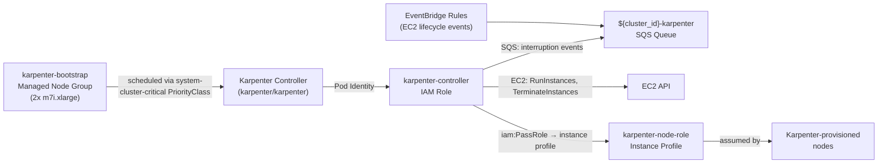

# Karpenter Node Provisioning

**Last Updated Date**: 2026-08-18

## Summary

All EKS clusters use self-managed Karpenter for node provisioning. A dedicated
`karpenter-bootstrap` managed node group (2x m7i.xlarge) provides stable capacity for the Karpenter
controller and ArgoCD. The Karpenter controller IAM role uses EKS Pod Identity, consistent with
all other platform workloads.

## Context

When clusters migrated from EKS Auto Mode to self-managed Karpenter, the Karpenter controller
needed an IAM authentication mechanism. EKS Pod Identity is the platform standard used by all
other controllers (Thanos, Loki, kube-applier, AWS Load Balancer Controller, ZOA jobs, EBS CSI,
External Secrets Operator). Karpenter v1 supports Pod Identity, so the same mechanism is used
here.

## Decision: Pod Identity for Karpenter Controller

**Chosen**: EKS Pod Identity for the Karpenter controller, consistent with all other workloads.

**Rationale**: Pod Identity eliminates the OIDC provider resource, the `tls` provider dependency,
and the IRSA annotation plumbing chain (Terraform output -> ECS env var -> cluster secret
annotation -> ApplicationSet valuesObject -> Helm serviceAccount annotation). The
`aws_eks_pod_identity_association` is declared next to the role in
`terraform/modules/eks-cluster/iam.tf`.

## Architecture

## IAM Resources

### Karpenter Controller Role (Pod Identity)

- **Name**: `${cluster_id}-karpenter-controller`
- **Trust**: `pods.eks.amazonaws.com`; bound to `karpenter/karpenter` via
  `aws_eks_pod_identity_association`
- **Permissions**: EC2 fleet operations (describe, run, terminate instances), IAM PassRole to the
  node role, SQS receive/delete on the interruption queue, `eks:DescribeCluster`,
  `ssm:GetParameter` (AMI alias resolution), `pricing:GetProducts`
- **Optional inline policy**: `kms:CreateGrant` (scoped to AWS service principals via
  `kms:GrantIsForAWSResource`) and `kms:DescribeKey` on the FIPS AMI KMS key when
  `ami_kms_key_arn` is set — lets EC2 decrypt the FIPS AMI's encrypted EBS snapshot on instance
  launch

### Karpenter Node Role

- **Name**: `${cluster_id}-karpenter-node-role`
- **Managed policies**: `AmazonEKSWorkerNodePolicy`, `AmazonEKS_CNI_Policy`,
  `AmazonEC2ContainerRegistryPullOnly`, `AmazonSSMManagedInstanceCore`
- **Referenced in**: `EC2NodeClass.spec.instanceProfile` (a pre-created instance profile,
  rather than `spec.role`, to avoid the Karpenter controller needing `iam:CreateInstanceProfile`)

### SQS Queue and EventBridge Rules

The `eks-cluster` module provisions:

- SQS queue (`${cluster_id}-karpenter`) with SQS-managed SSE, allowing `events.amazonaws.com`
  to send messages
- Four EventBridge rules forwarding EC2 events to the queue:
  - `spot-interruption` (EC2 Spot Instance Interruption Warning)
  - `instance-terminated` (EC2 Instance State-change Notification, filtered to `state=terminated`)
  - `rebalance-recommendation` (EC2 Instance Rebalance Recommendation)
  - `health-scheduled-change` (AWS Health scheduled-change events for EC2)

## Consequences

### Positive

- Pod Identity is the platform standard — no special case for Karpenter
- No OIDC provider resource or `tls` provider dependency per cluster
- No IRSA annotation plumbing through ECS -> cluster secret -> ApplicationSet -> Helm
- Karpenter controller role trust policy is scoped to a single ServiceAccount
- SQS interruption handling enables graceful draining before spot reclamation or instance retirement
- Self-managed Karpenter can be upgraded independently via Helm without AWS EKS Auto Mode release cycles

### Negative

- None specific to Pod Identity; it is the same mechanism used by all other workloads

## Related

- [FIPS-Only EKS Compute](./fips-eks-compute.md) — EC2NodeClass and NodePool design for FIPS workloads
- [ECS Fargate Bootstrap](./fully-private-eks-bootstrap.md) — How Karpenter is installed during cluster bootstrap
- [Karpenter documentation](https://karpenter.sh/docs/)
