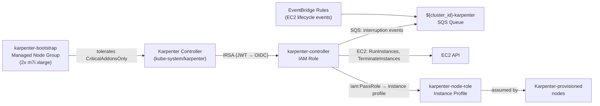

# Karpenter Node Provisioning

**Last Updated Date**: 2026-08-10

## Summary

All EKS clusters use self-managed Karpenter for node provisioning. A dedicated
`karpenter-bootstrap` managed node group (2× m7i.xlarge) provides stable capacity for the Karpenter
controller and ArgoCD (t3.medium → t3.large → m7i.xlarge, sized up to give ArgoCD HA replicas and
the redis-ha subchart room to schedule).
The Karpenter controller IAM role uses IRSA (IAM Roles for Service Accounts). While EKS Pod
Identity is the ZOA platform standard, IRSA was chosen for this repository as it is fully
supported by AWS and simplifies the Karpenter Helm chart configuration.

## Context

When clusters migrated from EKS Auto Mode to self-managed Karpenter, two IAM authentication mechanisms
were available for the Karpenter controller ServiceAccount:

- **IRSA (IAM Roles for Service Accounts)**: ServiceAccount carries an annotation
  (`eks.amazonaws.com/role-arn`); the OIDC provider validates the JWT and assumes the annotated
  role. Requires an OIDC provider resource (`aws_iam_openid_connect_provider`) per cluster.
- **EKS Pod Identity**: Newer mechanism; IAM role is bound to a ServiceAccount via an API
  association (no annotation needed). Simpler Terraform — no OIDC provider resource required.

## Decision: IRSA for Karpenter Controller

**Chosen**: IRSA for the Karpenter controller; EKS Pod Identity for all other workloads.

**Rationale**: IRSA was chosen for this repository because Karpenter ships with built-in IRSA
support via the `serviceAccount.annotations` Helm value. EKS Pod Identity is the ZOA platform
standard and remains supported by AWS alongside IRSA. While AWS recommends EKS Pod Identity for
new workloads, IRSA simplifies the Helm chart configuration for this repository by avoiding
additional Pod Identity association resources in Terraform.

All other platform workloads (Thanos, Loki, kube-applier, AWS Load Balancer Controller, ZOA
jobs) use EKS Pod Identity exclusively.

## Architecture

## IAM Resources

### Karpenter Controller Role (IRSA)

- **Name**: `${cluster_id}-karpenter-controller`
- **Trust**: OIDC provider for the cluster; constrained to `system:serviceaccount:kube-system:karpenter`
- **Permissions**: EC2 fleet operations (describe, run, terminate instances), IAM PassRole to the
  node role, SQS receive/delete on the interruption queue, `eks:DescribeCluster`,
  `ssm:GetParameter` (AMI alias resolution), `pricing:GetProducts`
- **Optional inline policy**: `kms:CreateGrant` (scoped to AWS service principals via
  `kms:GrantIsForAWSResource`) and `kms:DescribeKey` on the FIPS AMI KMS key when
  `ami_kms_key_arn` is set — lets EC2 decrypt the RHEL FIPS AMI's encrypted EBS snapshot on
  instance launch

### Karpenter Node Role

- **Name**: `${cluster_id}-karpenter-node-role`
- **Managed policies**: `AmazonEKSWorkerNodePolicy`, `AmazonEKS_CNI_Policy`,
  `AmazonEC2ContainerRegistryPullOnly`, `AmazonSSMManagedInstanceCore`
- **Referenced in**: `EC2NodeClass.spec.instanceProfile` (a pre-created instance profile ARN,
  rather than `spec.role`, to avoid the Karpenter controller needing `iam:CreateInstanceProfile`)

### SQS Queue and EventBridge Rules

The `eks-cluster` module provisions:

- SQS queue (`${cluster_id}-karpenter`) with SQS-managed SSE, allowing `events.amazonaws.com`
  to send messages
- Four EventBridge rules forwarding EC2 events to the queue:
  - `spot-interruption` (EC2 Spot Instance Interruption Warning)
  - `instance-terminated` (EC2 Instance State-change Notification, filtered to `state=terminated`)
  - `rebalance-recommendation` (EC2 Instance Rebalance Recommendation)
  - `health-scheduled-change` (AWS Health scheduled-change events for EC2)

## Consequences

### Positive

- IRSA is fully supported by AWS and requires the cluster's OIDC provider; no EKS Pod Identity association resource is needed
- Karpenter controller role trust policy is scoped to a single ServiceAccount — no broader cluster-level access
- SQS interruption handling enables graceful draining before spot reclamation or instance retirement
- Self-managed Karpenter can be upgraded independently via Helm without AWS EKS Auto Mode release cycles

### Negative

- One OIDC provider resource (`aws_iam_openid_connect_provider`) is required per cluster
- IRSA and Pod Identity coexist; operators must know which mechanism applies to which workload (Karpenter = IRSA, everything else = Pod Identity)

## Related

- [FIPS-Only EKS Compute](./fips-eks-compute.md) — EC2NodeClass and NodePool design for FIPS workloads
- [ECS Fargate Bootstrap](./fully-private-eks-bootstrap.md) — How Karpenter is installed during cluster bootstrap
- [Karpenter documentation](https://karpenter.sh/docs/)
- [IRSA documentation](https://docs.aws.amazon.com/eks/latest/userguide/iam-roles-for-service-accounts.html)
