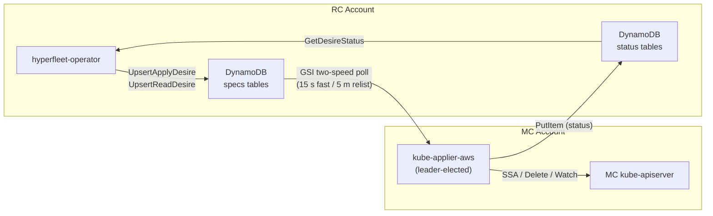
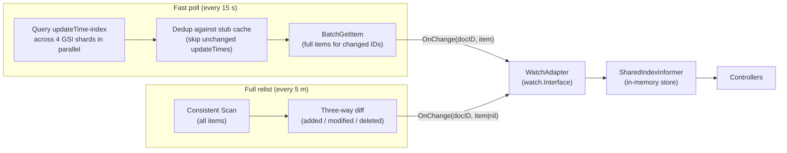
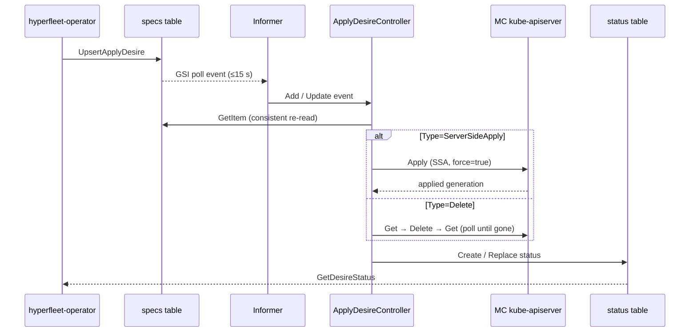
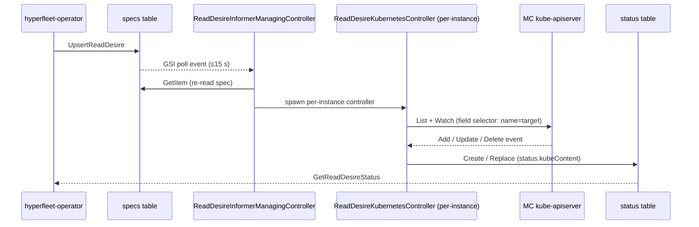

# kube-applier: DynamoDB-Backed Resource Distribution to Management Clusters

**Last Updated Date**: 2026-08-20

## Summary

`kube-applier-aws` bridges the desire loop between the hyperfleet-operator and
management cluster (MC) kube-apiservers. The operator writes declarative desire
documents to DynamoDB; kube-applier reads them via a GSI two-speed polling
watcher, applies or deletes the corresponding Kubernetes resources on the MC,
and writes status back to DynamoDB for the operator to consume.

## Context

Management clusters run in isolated AWS accounts with no direct network path
from the Regional Cluster (RC) where the hyperfleet-operator runs. A
lightweight, stateless bridge is needed that:

- Applies arbitrary Kubernetes resources to an MC kube-apiserver on behalf of
  the operator (server-side apply)
- Mirrors live MC resource state back to the operator (read-back)
- Handles deletion including finalizer drain
- Operates without persistent local state — all desire input and status output
  flows through DynamoDB
- Scales to multiple replicas without coordination overhead

## Architecture

### System Overview



### DynamoDB Tables

Four tables are provisioned per MC in the RC account. The partition key in
every table is `documentID` (string, UUID v5).

| Table                      | Direction               | GSI                |
| -------------------------- | ----------------------- | ------------------ |
| `{mc}-specs-applydesires`  | operator → kube-applier | `updateTime-index` |
| `{mc}-specs-readdesires`   | operator → kube-applier | `updateTime-index` |
| `{mc}-status-applydesires` | kube-applier → operator | `updateTime-index` |
| `{mc}-status-readdesires`  | kube-applier → operator | `updateTime-index` |

Deletion is expressed as an `ApplyDesire` with `spec.type=Delete` — there are
no separate `deletedesires` tables.

### Cross-Account Access

The MC account EKS cluster hosts kube-applier. EKS Pod Identity associates the
`kube-applier` ServiceAccount to an IAM role in the MC account. That role
carries cross-account policies scoped to the RC account table ARNs:

- **Specs tables**: `GetItem`, `BatchGetItem`, `Scan`, `Query` (table + index)
- **Status tables**: `GetItem`, `BatchGetItem`, `Scan`, `Query`, `PutItem`,
  `DeleteItem` (table + index)

No static credentials are used.

## Desire Types

### ApplyDesire

An `ApplyDesire` targets a single Kubernetes object. The `spec.type` field
discriminates the operation:

| Type                        | Operation                                                                  |
| --------------------------- | -------------------------------------------------------------------------- |
| `ServerSideApply` (default) | SSA-patch `spec.serverSideApply.kubeContent` onto the MC with `Force=true` |
| `Delete`                    | Delete `spec.targetItem` from the MC; poll until finalizers drain          |

`spec.targetItem` carries the GVR (`group`, `version`, `resource`), `name`,
and optional `namespace`. For `ServerSideApply`, `spec.serverSideApply.kubeContent`
is the full Kubernetes object as a JSON string.

### ReadDesire

A `ReadDesire` mirrors a live MC object back to DynamoDB. `spec.targetItem`
identifies the resource to watch. The controller issues a single-object
ListWatch on the MC kube-apiserver and writes the live JSON into
`status.kubeContent` on every change.

## Change Detection: Two-Speed GSI Engine

kube-applier uses the `hyperfleet-dynamo` package to watch the specs tables
without DynamoDB Streams. Two concurrent loops share an in-memory stub cache
(`documentID → updateTime`):



**Expanding lookback window**: immediately after a relist, the fast-poll window
starts near zero and grows by elapsed time each tick, capped at the relist
interval. This avoids rescanning records the relist just covered.

**Deletions**: only detected by the relist (items vanish from the GSI on hard
delete). The relist delivers `OnChange(docID, nil)`, which the WatchAdapter
translates into a `watch.Deleted` event.

**No consumer limit**: unlike DynamoDB Streams (capped at 2 consumers per
shard), the GSI approach allows any number of kube-applier replicas. Only the
leader actively polls; standby replicas do not start informers.

## ApplyDesire Reconcile Flow



### Status Conditions

Both condition types (`Successful`, `Degraded`) are written on every reconcile.

| Outcome                                                      | Successful                   | Degraded |
| ------------------------------------------------------------ | ---------------------------- | -------- |
| SSA accepted / object deleted                                | `True`                       | absent   |
| Finalizers draining                                          | `False` (WaitingForDeletion) | absent   |
| Bad spec (invalid JSON, missing fields)                      | `False` (PreCheckError)      | absent   |
| Kube API 4xx                                                 | `False` (ReconcileError)     | absent   |
| Infrastructure error (unreachable apiserver, DynamoDB error) | `False` (ReconcileError)     | `True`   |

### Cooldown

| Type              | Cooldown | Reason                                       |
| ----------------- | -------- | -------------------------------------------- |
| `ServerSideApply` | 10 min   | Prevents busy-looping on status write echoes |
| `Delete`          | 1 min    | Keeps polling for finalizer completion       |

Desires with a changed `UpdateTime` always bypass the cooldown gate.

## ReadDesire Reconcile Flow



The manager owns per-instance controller lifecycle — it starts a new controller
when a ReadDesire appears, restarts it if `spec.targetItem` changes, and stops
it when the ReadDesire is deleted. A 60-second unconditional resync ticker
ensures non-existence is reflected even when the Watch stream delivers no events.

## Document IDs

Every desire document carries a deterministic UUID v5:

```
documentID = UUIDv5(a3f1b2c4-d5e6-4f7a-8b9c-0d1e2f3a4b5c,
                    "{taskKey}/{group}/{version}/{resource}/{namespace}/{name}")
```

The same inputs always produce the same UUID. Re-reconciling a resource writes
the same document ID, updating the existing row rather than creating a duplicate.

## Deployment

kube-applier runs as a single-replica leader-elected Deployment in the
`kube-applier` namespace on each MC. The ArgoCD ApplicationSet in
`argocd/config/management-cluster/kube-applier/` injects the MC name and region
at render time. The DynamoDB tables for each MC are provisioned by the
`kube-applier-dynamodb` Terraform module (see
`terraform/modules/kube-applier-dynamodb/`).

### Scale Characteristics

| Dimension                   | Value                                |
| --------------------------- | ------------------------------------ |
| Replicas                    | 1 active (leader elected); N standby |
| GSI fast-poll interval      | 15 s                                 |
| Full relist interval        | 5 m                                  |
| ApplyDesire SSA cooldown    | 10 min                               |
| ApplyDesire Delete cooldown | 1 min                                |
| ReadDesire resync ticker    | 60 s                                 |
| Apply worker threads        | 4                                    |
| Read manager threads        | 1                                    |
