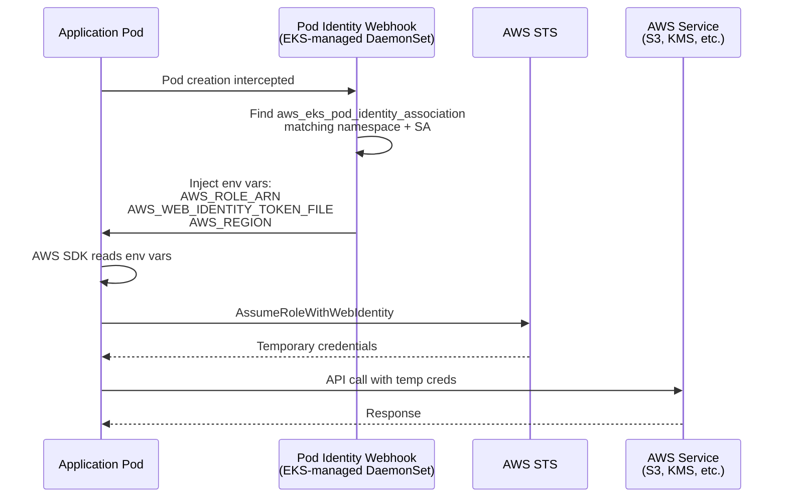

# EKS Pod Identity Migration

**Last Updated Date**: 2026-08-12

## Summary

The ROSA HyperFleet platform uses EKS Pod Identity exclusively for all AWS IAM authentication. IRSA (IAM Roles for Service Accounts) has been fully removed from platform infrastructure.

This document explains why Pod Identity is the platform standard, documents the migration timeline, and provides reference implementation patterns.

## Context

### Why Pod Identity Over IRSA

EKS Pod Identity is simpler and more maintainable than IRSA:

| Aspect                    | IRSA                                         | Pod Identity                          |
| ------------------------- | -------------------------------------------- | ------------------------------------- |
| **Terraform**             | OIDC provider, tls_certificate, tls provider | Just role + association               |
| **Service Account**       | Annotation with role ARN                     | No annotation needed                  |
| **Helm Values**           | Must inject role ARN from Terraform          | No Helm values needed                 |
| **Trust Policy**          | Complex OIDC conditions (issuer, aud, sub)   | Simple `pods.eks.amazonaws.com`       |
| **Debugging**             | Trace annotation → values → Terraform        | `kubectl describe pod` shows env vars |
| **Scope**                 | Namespace-level                              | Namespace + ServiceAccount            |
| **CloudTrail Visibility** | Only IAM role ARN                            | Pod namespace, SA, cluster name       |

### Migration Timeline

| Date       | Component  | Commit   | Change                                     |
| ---------- | ---------- | -------- | ------------------------------------------ |
| 2026-08-12 | Karpenter  | 8b9a3661 | IRSA → Pod Identity, removed OIDC provider |
| 2026-08-12 | Thanos     | (this)   | Remove stale IRSA annotation               |
| Prior      | All others | Various  | 30+ Pod Identity associations              |

All platform controllers now use Pod Identity:

- Thanos (receiver, store, compact, ruler, ingester)
- Karpenter
- AWS Load Balancer Controller
- EBS CSI Driver
- kube-applier
- external-dns
- cert-manager
- Loki forwarder
- Prometheus remote write
- CloudWatch exporter
- Grafana CloudWatch logs
- ZOA jobs
- Platform API authz

## Standard Implementation Pattern

Every module that needs AWS IAM authentication follows this pattern:

### 1. IAM Role with Pod Identity Trust Policy

```hcl
resource "aws_iam_role" "example" {
  name = "${var.cluster_id}-example"

  assume_role_policy = jsonencode({
    Version = "2012-10-17"
    Statement = [{
      Effect = "Allow"
      Principal = {
        Service = "pods.eks.amazonaws.com"
      }
      Action = [
        "sts:AssumeRole",
        "sts:TagSession"
      ]
    }]
  })

  tags = {
    Name = "${var.cluster_id}-example"
  }
}
```

### 2. IAM Role Policy (Permissions)

```hcl
resource "aws_iam_role_policy" "example" {
  name = "example-permissions"
  role = aws_iam_role.example.id

  policy = jsonencode({
    Version = "2012-10-17"
    Statement = [
      {
        Effect = "Allow"
        Action = [
          "s3:GetObject",
          "s3:PutObject"
        ]
        Resource = "arn:aws:s3:::bucket-name/*"
      }
    ]
  })
}
```

### 3. Pod Identity Association (Binding)

```hcl
resource "aws_eks_pod_identity_association" "example" {
  cluster_name    = var.eks_cluster_name
  namespace       = "example-namespace"
  service_account = "example-sa"
  role_arn        = aws_iam_role.example.arn

  tags = {
    Name = "${var.cluster_id}-example"
  }
}
```

### 4. ServiceAccount (Helm Chart)

```yaml
apiVersion: v1
kind: ServiceAccount
metadata:
  name: example-sa
  namespace: example-namespace
# NO annotations needed - Pod Identity association handles authentication
```

## How Pod Identity Works



## Reference Implementations

### Simple Pattern (Single ServiceAccount)

See: `terraform/modules/authz/iam.tf`

- One IAM role
- One Pod Identity association
- One ServiceAccount in Helm chart

### Multi-ServiceAccount Pattern

See: `terraform/modules/thanos-infrastructure/main.tf`

- Two IAM roles (read-write, read-only)
- Five Pod Identity associations (one per component SA)
- ServiceAccounts created by thanos-community operator

### Cross-Account AssumeRole Pattern

See: `terraform/modules/dns-pod-identity/main.tf`

- Local Pod Identity role (MC-side)
- Inline policy granting `sts:AssumeRole` to RC role
- Used for cross-account DNS operations

## Debugging Pod Identity

### Verify Pod Identity Association Exists

```bash
aws eks list-pod-identity-associations --cluster-name <cluster-name>
```

### Check Pod Has Injected Credentials

```bash
kubectl get pod <pod-name> -n <namespace> -o yaml | grep AWS_
```

Expected env vars:

- `AWS_ROLE_ARN`
- `AWS_WEB_IDENTITY_TOKEN_FILE`
- `AWS_REGION`

### Verify Role Assumption Works

```bash
kubectl exec -it <pod-name> -n <namespace> -- aws sts get-caller-identity
```

Should show assumed role ARN.

### Check CloudTrail for AssumeRole Events

```bash
aws cloudtrail lookup-events \
  --lookup-attributes AttributeKey=EventName,AttributeValue=AssumeRole \
  --max-results 10
```

Pod Identity events include `eks:eks-cluster-name`, `eks:namespace`, `eks:service-account-name` in
session tags.

## Migration Checklist (Historical)

When migrating a component from IRSA to Pod Identity:

- [ ] Create `aws_iam_role` with `pods.eks.amazonaws.com` trust policy
- [ ] Create `aws_eks_pod_identity_association` resource
- [ ] Remove `aws_iam_openid_connect_provider` if no longer used
- [ ] Remove `data.tls_certificate` if no longer used
- [ ] Remove `tls` provider from `versions.tf` if no longer used
- [ ] Remove IRSA annotation from ServiceAccount
- [ ] Remove role ARN from Helm values
- [ ] Remove role ARN output and threading (if applicable)
- [ ] Update design docs to reflect Pod Identity
- [ ] Test in ephemeral environment before production

## Related Documentation

- Karpenter Pod Identity migration (commit `8b9a3661`) - Documented Karpenter's IRSA → Pod Identity
  migration
- [Thanos Metrics Infrastructure](thanos-metrics-infrastructure.md) - Thanos architecture
- [Regional OIDC Ownership](regional-oidc-ownership.md) - Customer ROSA HCP cluster OIDC
  (separate from platform Pod Identity)
- AWS: [EKS Pod Identity](https://docs.aws.amazon.com/eks/latest/userguide/pod-identities.html)
- AWS: [Migrate from IRSA to Pod Identity](https://docs.aws.amazon.com/eks/latest/userguide/pod-id-abac.html#pod-id-abac-migrate)
