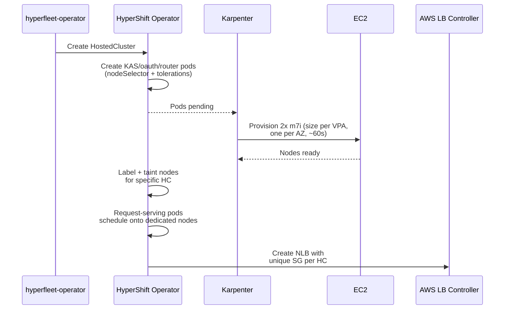
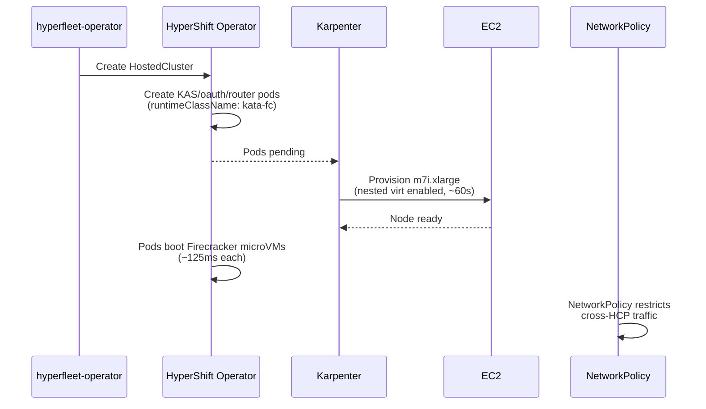

# Request Serving Isolation on EKS: Options Comparison

**Last Updated Date**: 2026-08-05

## Requirements

Each HCP's request-serving workloads (kube-apiserver, oauth, router, ignition-server-proxy, metrics-proxy) must have:

- **Hardware isolation.** No other customer's workloads share the same compute or memory. A compromised workload in one HCP must not be able to access another HCP's processes, memory, or filesystem.
- **Network isolation.** One HCP's request-serving traffic must not be observable or interceptable by another HCP. This applies to both data plane traffic (API server requests) and control plane traffic between request-serving components.

These are hard requirements for a multi-tenant managed service. Both options below are evaluated against these criteria.

**Common to both options:** Kubernetes NetworkPolicies (VPC CNI native support, built into EKS) should be deployed to block active cross-HCP pod-to-pod connections. By default, Kubernetes allows all pod-to-pod communication. Without NetworkPolicy, a compromised pod in one HCP could connect to another HCP's pods over the pod network. This applies equally to both isolation models.

## Status Quo (OpenShift)

HyperShift isolates 5 request-serving components (kube-apiserver, oauth, router, ignition-server-proxy, metrics-proxy) onto **dedicated node pairs**: 2 nodes per HCP, one per AZ, provisioned via MachineSets. Nodes are tainted (`hypershift.openshift.io/cluster=<ns-name>:NoSchedule`) so only that HCP's request-serving pods can schedule there. All other control plane pods (etcd, controllers, operators) bin-pack onto shared nodes.

**Network isolation** comes from per-HCP subnets + NLBs. The OCP Load Balancer Controller uses a single shared Security Group for all NLBs and appends per-HCP rules, hitting the SG rule limit at ~64 HCPs per MC.

**Key insight for EKS:** The AWS Load Balancer Controller ([v2.6.0+](https://aws.amazon.com/blogs/containers/network-load-balancers-now-support-security-groups/)) creates a frontend SG per NLB plus one shared backend SG per cluster. The backend SG uses SG-to-SG referencing, so worker node SG rules stay constant regardless of NLB count. This eliminates the rule accumulation problem. The ~64 HCP ceiling is an OpenShift-specific artifact, not inherent to the architecture.

---

## Option A: Karpenter Dedicated Nodes

**Hardware isolation:** Same model as today. Each HCP gets a dedicated EC2 instance pair (one per AZ). Karpenter replaces MachineSets.

**Network isolation:** Two sub-options:

|                      | Per-HCP Subnets (A1)                                                                                               | Shared Subnets + Per-NLB SG (A2)                                                                                                                                                                                                                                                                                                                                                                                                                                                                                                                                                                                                     |
| -------------------- | ------------------------------------------------------------------------------------------------------------------ | ------------------------------------------------------------------------------------------------------------------------------------------------------------------------------------------------------------------------------------------------------------------------------------------------------------------------------------------------------------------------------------------------------------------------------------------------------------------------------------------------------------------------------------------------------------------------------------------------------------------------------------ |
| Isolation level      | Each HCP's nodes sit in their own subnet, with independent routing and NACLs                                       | All HCP nodes share the same subnets, but each EC2 instance is isolated by the [Nitro hypervisor](https://docs.aws.amazon.com/whitepapers/latest/security-design-of-aws-nitro-system/the-components-of-the-nitro-system.html) (instances cannot see each other's traffic even on the same subnet). On [Nitro v3+ types](https://docs.aws.amazon.com/AWSEC2/latest/UserGuide/data-protection.html#encryption-transit) (M6i, C6i, M7i, C7i and newer), inter-instance traffic is also hardware-encrypted (AES-256-GCM on the Nitro Card). Earlier Nitro types (M5, C5, T3) provide hypervisor isolation but not encryption in transit. |
| Subnet provisioning  | Terraform pre-creates 2 subnets per HCP                                                                            | None. Use existing 3 private /18 subnets                                                                                                                                                                                                                                                                                                                                                                                                                                                                                                                                                                                             |
| EC2NodeClass         | One per HCP (unique subnet selectors)                                                                              | One shared (all private subnets)                                                                                                                                                                                                                                                                                                                                                                                                                                                                                                                                                                                                     |
| NodePool             | One per HCP                                                                                                        | One shared (VPA + Karpenter right-size nodes)                                                                                                                                                                                                                                                                                                                                                                                                                                                                                                                                                                                        |
| HCP limit per VPC    | ~100 ([200 subnet VPC limit](https://docs.aws.amazon.com/vpc/latest/userguide/amazon-vpc-limits.html), adjustable) | **No inherent limit.** Bounded by IP space (~49K IPs in 3x/18)                                                                                                                                                                                                                                                                                                                                                                                                                                                                                                                                                                       |
| Operational overhead | High (Terraform per HCP, many NodePools)                                                                           | Low (static infra, 1 NodePool)                                                                                                                                                                                                                                                                                                                                                                                                                                                                                                                                                                                                       |

**Recommendation: A2** (shared subnets). With dedicated nodes, each HCP's request-serving pods run on their own EC2 instances. No other customer's workloads share that machine. The Nitro hypervisor guarantees that one instance cannot observe another's network traffic, even on the same subnet (no promiscuous mode, no ARP spoofing). On M7i instances (which we use), inter-instance traffic is also hardware-encrypted (AES-256-GCM). The AWS LB Controller creates a frontend SG per NLB, so each HCP's load balancer gets its own firewall rules.

This needs **explicit validation with AWS** that instance-level isolation on shared subnets satisfies their security bar for ROSA HCP, or whether they specifically require separate subnets per HCP.

### Changes Needed

**HyperShift (upstream):**

- Add a Karpenter-aware code path alongside the existing MachineSet-based autoscaler. ROSA HCP v1 coexists, so both must be supported. The operator selects the path based on whether the MC is OpenShift (MachineSets) or EKS (Karpenter). On EKS, Karpenter provisions nodes on-demand from pending pods ([~60s](https://lablabs.io/blog/scaling-nodes-from-zero-the-bottleneck)). No warm pool needed.
- The `DedicatedServingComponentSchedulerAndSizer` is still needed but simplified for EKS: watches unscheduled HCs, request-serving pods pend directly (no placeholder indirection), Karpenter provisions nodes, scheduler labels/taints them for the specific HC.
- Node pairing logic (`osd-fleet-manager.openshift.io/paired-nodes`) needs adaptation for EKS: today pair labels are pre-set on MachineSets. With Karpenter, pairing must happen post-provisioning (scheduler assigns pair labels once 2 nodes in different AZs are available).
- Deploy VPA in enforcing mode for request-serving pods (KAS, oauth, router). VPA dynamically adjusts resource requests based on actual usage. Karpenter right-sizes nodes to match. Proactive overrides: an annotation on HostedCluster that floors KAS resource requests for customers with known spiky workloads. Replaces ClusterSizingConfiguration / t-shirt sizing.

**HyperFleet (rosa-hyperfleet):**

- Add 1 Karpenter NodePool for request-serving nodes with:
  - Taints: `hypershift.openshift.io/request-serving-component=true:NoSchedule`, `hypershift.openshift.io/control-plane=true:NoSchedule`
  - Labels: `hypershift.openshift.io/request-serving-component=true`
  - Instance types: m7i.xlarge through m7i.4xlarge (Karpenter selects cheapest that fits)
  - Topology spread: `topology.kubernetes.io/zone` (max skew 1)
  - Consolidation: `WhenEmpty` (never consolidate occupied nodes)
- Add corresponding `EC2NodeClass` (shared subnets, FIPS, same SG selector as existing)
- Deploy VPA controller on MCs (not included in EKS by default). HyperShift creates the VPA resources, the MC needs the controller to act on them.
- Configure AWS LB Controller to create per-NLB SGs (verify this is the default; if not, set annotation on Service resources)

### Provisioning & Autoscaling Flow

**Scale-down:** When HC is deleted, request-serving pods are removed but HC-specific taints are kept. This prevents any other HCP from scheduling on the node (no data leakage from memory/disk). The node stays empty and tainted. Karpenter sees an empty node and terminates it after `consolidateAfter` (set short, e.g. 30s, since taints guarantee nothing else will schedule). Next HCP gets a fresh instance.

---

## Option B: Kata Containers with Firecracker (MicroVM Isolation)

**Hardware isolation:** Each request-serving pod runs inside a [Firecracker](https://firecracker-microvm.github.io/) microVM via Kata Containers. Multiple HCPs can share a physical node. Isolation is at the VM boundary, not the node boundary.

**Why Firecracker over QEMU:** Kata supports both QEMU and Firecracker as VMM backends. Firecracker is the better fit for this use case:

- **Smaller attack surface.** ~50K lines of Rust vs QEMU's ~2M+ lines of C. Minimal device model (virtio-net, virtio-blk only), no legacy device emulation.
- **Lower overhead.** ~5 MiB per VM vs QEMU's 30-130 MiB. Faster boot (~125ms vs ~200ms).
- **Purpose-built for multi-tenant isolation.** AWS built Firecracker for Lambda and Fargate. It is designed for exactly this workload pattern.

The limitations (no GPU passthrough, no live migration, no SCSI) are irrelevant for request-serving pods.

**Network isolation:** Each Kata VM gets its own network namespace. Passively observing another HCP's traffic requires a VM escape (Firecracker vulnerability), the same class of attack as a Nitro hypervisor escape in Option A. The difference is the trust boundary: in Option A, the hypervisor is AWS-managed hardware (Nitro). In Option B, the hypervisor is Firecracker running on our nodes, which we are responsible for patching. Firecracker's small Rust codebase significantly reduces CVE exposure compared to a general-purpose VMM.

### Requirements

- **Nested virtualization on standard instances.** As of Feb 2026, EC2 supports nested virtualization on non-metal instances. Instances must be launched with `CpuOptions.NestedVirtualization=enabled`. Supported families: C7i, M7i, R7i, I7i, C8i, M8i, R8i and variants. m7i.xlarge: 4 vCPU, 16 GiB, ~$0.20/hr.
- **Fixed per-pod overhead.** ~250m CPU, ~5 MiB memory for the Firecracker VMM process itself. Guest kernel adds ~30-50 MiB. Total overhead is small relative to request-serving pod sizes (KAS uses multiple GiB). Density impact is minimal.

### Changes Needed

**HyperShift (upstream):**

- Add `runtimeClassName: kata-fc` to request-serving component Deployments when a new annotation/flag enables Kata mode. No resource request changes needed. Kubernetes automatically accounts for VM overhead via `PodOverhead` defined in the RuntimeClass.
- Remove or make optional the dedicated-node scheduling logic. Kata provides hardware isolation without dedicated nodes, but the isolation boundary shifts from AWS-managed (Nitro) to self-managed (Firecracker).
- The scheduler and pairing logic would need rethinking since the 1:1 node:HCP model no longer applies

**HyperFleet (rosa-hyperfleet):**

- Deploy `kata-deploy` Helm chart (DaemonSet that installs Kata runtime + creates RuntimeClasses)
- Create Karpenter NodePool for Kata-capable nodes with label `katacontainers.io/kata-runtime=true`
- Create EC2NodeClass with `cpuOptions.nestedVirtualization: "enabled"` (natively supported in Karpenter v1.13.0, which auto-filters to supported instance families).

### Provisioning & Autoscaling Flow

---

## Comparison

| Dimension                  | A: Karpenter Dedicated Nodes                                                                                                                              | B: Kata Containers                                                                                                                                                                            |
| -------------------------- | --------------------------------------------------------------------------------------------------------------------------------------------------------- | --------------------------------------------------------------------------------------------------------------------------------------------------------------------------------------------- |
| **Hardware isolation**     | Node-level (dedicated EC2 per HCP pair)                                                                                                                   | VM-level (microVM per pod, shared host)                                                                                                                                                       |
| **Network isolation**      | Nitro hypervisor between instances + hardware encryption on M7i. AWS-managed, AWS-patched.                                                                | VM boundary (Firecracker). Same isolation model, but we own and patch the hypervisor.                                                                                                         |
| **HCPs per MC**            | ~200+ with shared subnets (IP-space bounded). 2 dedicated nodes per HCP.                                                                                  | Higher per-node density (multiple HCPs share nodes). Firecracker overhead (~5 MiB VMM + ~40 MiB guest kernel per pod) is negligible for request-serving pod sizes.                            |
| **Node cost per HCP**      | 2x m7i.xlarge (~$0.20/hr x 2 = $0.40/hr)                                                                                                                  | With shared nodes: potentially lower per-HCP cost since multiple HCPs share larger instances. VM overhead is small for large pods. No bare metal premium (nested virt on standard instances). |
| **Cold start**             | ~60s (standard EC2 via Karpenter)                                                                                                                         | ~60s (same, standard instances with nested virt) + ~125ms Firecracker boot per pod                                                                                                            |
| **Warm pool**              | Not needed. ~60s Karpenter provisioning.                                                                                                                  | Not needed. ~60s Karpenter provisioning.                                                                                                                                                      |
| **HyperShift changes**     | Moderate. Add Karpenter code path alongside existing MachineSet path, adapt pairing logic.                                                                | Large. New RuntimeClass support, rethink scheduling model, adjust resource accounting for VM overhead.                                                                                        |
| **HyperFleet changes**     | Small. Add 1 NodePool + EC2NodeClass + VPA.                                                                                                               | Medium. Kata deployment, custom EC2NodeClass for nested virt, NetworkPolicy rules.                                                                                                            |
| **Operational overhead**   | Low. Karpenter is already in use, same instance types.                                                                                                    | Medium. Kata runtime patching, Firecracker versioning, new debugging workflow for VM-in-container failures.                                                                                   |
| **SRE operational burden** | Standard EKS node troubleshooting. Familiar instance types, standard AMIs, Karpenter handles node lifecycle. Debugging is the same as any other EKS node. | Higher. Must maintain Kata runtime + Firecracker versions. Must debug VM-inside-container failures (new failure mode).                                                                        |
| **Implementation effort**  | **S/M.** Adapting a proven model. Mostly Helm templates in rosa-hyperfleet + scheduler code path in HyperShift.                                           | **L.** Net-new runtime, NetworkPolicy rules, scheduling model redesign, custom EC2NodeClass for nested virt.                                                                                  |
| **AWS security bar**       | Proven model (same isolation as today, minus dedicated subnets. Needs validation.)                                                                        | Novel. Kata on EKS is community-only, not AWS-supported. Nested virtualization is new (Feb 2026). Unclear if AWS accepts VM-boundary as equivalent.                                           |
| **Risk / unknowns**        | Low. Known technology, known failure modes. Main unknown is whether AWS accepts shared-subnet isolation.                                                  | Medium. Kata on EKS is community-only. Nested virt on EC2 is new (Feb 2026), limited production track record.                                                                                 |
| **Scalability ceiling**    | ~200 HCPs/MC (IP space), horizontally scales by adding MCs.                                                                                               | Similar ceiling with standard instances. Shared nodes could push higher density per MC.                                                                                                       |

---

## Recommendation

**Option B (Kata Containers)** with nested virtualization on standard instances is recommended:

1. **Cost efficiency.** With dedicated nodes (Option A), each HCP reserves 2 full EC2 instances regardless of actual utilization. With Kata, multiple HCPs share nodes and only pay for what they use. For a small HCP that uses 30% of an m7i.xlarge, Option A wastes 70% of 2 instances.
2. **Same isolation model.** Both options provide VM-level isolation. The difference is who manages the hypervisor: AWS (Nitro) vs us (Firecracker). Both require a VM escape to breach the isolation boundary.
3. **Simpler scheduling.** No dedicated node pairing, no post-provisioning label assignment, no node reaper. Pods schedule onto shared nodes like any other workload.
4. **Breaks the 64 HCP limit.** Per-NLB SGs eliminate the shared SG bottleneck (same as Option A).
5. **Higher density per MC.** Shared nodes mean more HCPs per MC, fewer MCs to operate.

**Tradeoffs vs Option A:**

- We own the hypervisor (Firecracker patching, versioning, debugging VM-in-container failures) instead of relying on AWS's Nitro.
- Kata on EKS is community-supported, not AWS-supported.
- Nested virtualization on EC2 is new (Feb 2026), limited production track record.
- More HyperShift changes: new RuntimeClass support, rethink scheduling model (no 1:1 node:HCP pairing).

## Open Questions

1. **Does AWS accept instance-level Nitro isolation (shared subnets + dedicated nodes) as meeting the ROSA HCP security bar?** This is the key gate for Option A2. If AWS requires separate subnets per HCP, we fall back to A1 (~100 HCP limit per VPC).
2. **AWS LB Controller SG behavior.** Verified: the AWS LB Controller (v2.6.0+) creates a frontend SG per NLB and a shared backend SG using SG-to-SG referencing. Worker node SG rules stay constant regardless of NLB count. Confirm this works correctly when HCPs have both public and private NLBs.
3. **Karpenter node pairing.** Today, pair labels are pre-set on MachineSets. With Karpenter, we need a post-provisioning pairing mechanism. Can the existing scheduler assign pair labels after Karpenter provisions nodes, or do we need Karpenter's `topologySpreadConstraints`?
