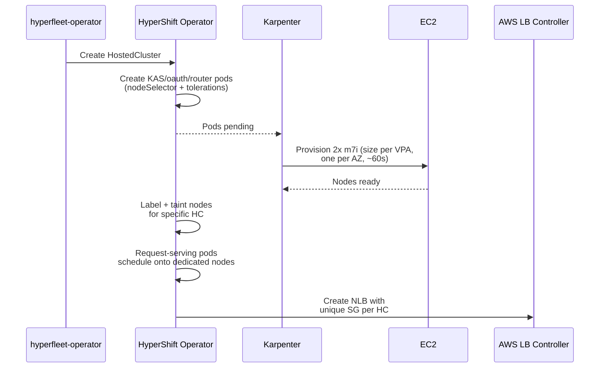
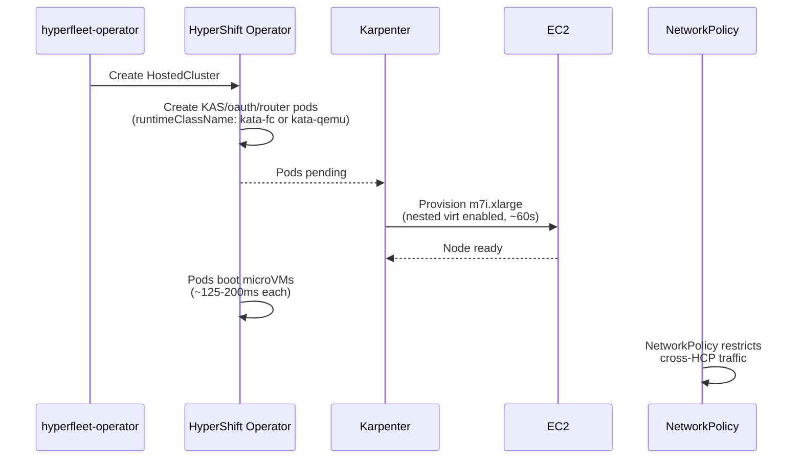
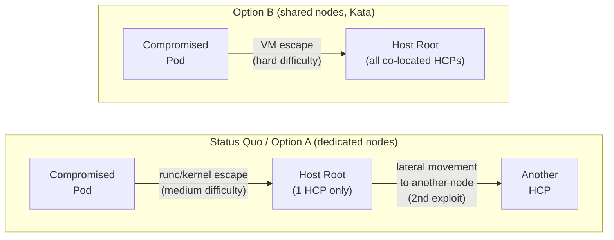

# Request Serving Isolation on EKS: Options Comparison

**Last Updated Date**: 2026-08-07

## Requirements

Each HCP's request-serving workloads (kube-apiserver, oauth, router, ignition-server-proxy, metrics-proxy) must have:

- **Hardware isolation.** A compromised workload in one HCP must not be able to access another HCP's processes, memory, or filesystem. This can be achieved via dedicated compute (one HCP per node) or VM-level isolation (one HCP per microVM on shared nodes).
- **Network isolation.** One HCP's request-serving traffic must not be observable or interceptable by another HCP. This applies to both data plane traffic (API server requests) and control plane traffic between request-serving components.

These are hard requirements for a multi-tenant managed service. Both options below are evaluated against these criteria.

**Common to all options:** Kubernetes NetworkPolicies (VPC CNI native support, built into EKS) should be deployed to block active cross-HCP pod-to-pod connections. By default, Kubernetes allows all pod-to-pod communication. Without NetworkPolicy, a compromised pod in one HCP could connect to another HCP's pods over the pod network. This applies equally to both isolation models.

## Status Quo (OpenShift)

HyperShift isolates 5 request-serving components (kube-apiserver, oauth, router, ignition-server-proxy, metrics-proxy) onto **dedicated node pairs**: 2 nodes per HCP, one per AZ, provisioned via MachineSets. Nodes are tainted (`hypershift.openshift.io/cluster=<ns-name>:NoSchedule`) so only that HCP's request-serving pods can schedule there. All other control plane pods (etcd, controllers, operators) bin-pack onto shared nodes.

**Network isolation** comes from per-HCP subnets + NLBs. The OCP Load Balancer Controller uses a single shared Security Group for all NLBs and appends per-HCP rules, hitting the SG rule limit at ~64 HCPs per MC.

**Key insight for EKS:** The AWS Load Balancer Controller ([v2.6.0+](https://aws.amazon.com/blogs/containers/network-load-balancers-now-support-security-groups/)) creates a frontend SG per NLB plus one shared backend SG per cluster. The backend SG uses SG-to-SG referencing, so worker node SG rules stay constant regardless of NLB count. This eliminates the rule accumulation problem. The ~64 HCP ceiling is an OpenShift-specific artifact, not inherent to the architecture.

---

## Option A: Karpenter Dedicated Nodes

**Hardware isolation:** Same model as today. Each HCP gets a dedicated EC2 instance pair (one per AZ). Karpenter replaces MachineSets.

**Network isolation:** Two sub-options:

|                      | Per-HCP Subnets (A1)                                                                                               | Shared Subnets + Per-NLB SG (A2)                                                                                                                                                                                                                                                                                                                                                                                                                                                                                                                                                                                                     |
| -------------------- | ------------------------------------------------------------------------------------------------------------------ | ------------------------------------------------------------------------------------------------------------------------------------------------------------------------------------------------------------------------------------------------------------------------------------------------------------------------------------------------------------------------------------------------------------------------------------------------------------------------------------------------------------------------------------------------------------------------------------------------------------------------------------ |
| Isolation level      | Each HCP's nodes sit in their own subnet, with independent routing and NACLs                                       | All HCP nodes share the same subnets, but each EC2 instance is isolated by the [Nitro hypervisor](https://docs.aws.amazon.com/whitepapers/latest/security-design-of-aws-nitro-system/the-components-of-the-nitro-system.html) (instances cannot see each other's traffic even on the same subnet). On [Nitro v3+ types](https://docs.aws.amazon.com/AWSEC2/latest/UserGuide/data-protection.html#encryption-transit) (M6i, C6i, M7i, C7i and newer), inter-instance traffic is also hardware-encrypted (AES-256-GCM on the Nitro Card). Earlier Nitro types (M5, C5, T3) provide hypervisor isolation but not encryption in transit. |
| Subnet provisioning  | Terraform pre-creates 2 subnets per HCP                                                                            | None. Use existing 3 private /18 subnets                                                                                                                                                                                                                                                                                                                                                                                                                                                                                                                                                                                             |
| EC2NodeClass         | One per HCP (unique subnet selectors)                                                                              | One shared (all private subnets)                                                                                                                                                                                                                                                                                                                                                                                                                                                                                                                                                                                                     |
| NodePool             | One per HCP                                                                                                        | One shared (VPA + Karpenter right-size nodes)                                                                                                                                                                                                                                                                                                                                                                                                                                                                                                                                                                                        |
| HCP limit per VPC    | ~100 ([200 subnet VPC limit](https://docs.aws.amazon.com/vpc/latest/userguide/amazon-vpc-limits.html), adjustable) | **No inherent limit.** Bounded by IP space (~49K IPs in 3x/18)                                                                                                                                                                                                                                                                                                                                                                                                                                                                                                                                                                       |
| Operational overhead | High (Terraform per HCP, many NodePools)                                                                           | Low (static infra, 1 NodePool)                                                                                                                                                                                                                                                                                                                                                                                                                                                                                                                                                                                                       |

**Recommendation: A2** (shared subnets). With dedicated nodes, each HCP's request-serving pods run on their own EC2 instances. No other customer's workloads share that machine. The Nitro hypervisor guarantees that one instance cannot observe another's network traffic, even on the same subnet (no promiscuous mode, no ARP spoofing). On M7i instances (which we use), inter-instance traffic is also hardware-encrypted (AES-256-GCM). The AWS LB Controller creates a frontend SG per NLB, so each HCP's load balancer gets its own firewall rules.

This needs **explicit validation with AWS** that instance-level isolation on shared subnets satisfies their security bar for ROSA HCP, or whether they specifically require separate subnets per HCP.

### Changes Needed

**HyperShift (upstream):**

- Add a Karpenter-aware code path alongside the existing MachineSet-based autoscaler. ROSA HCP v1 coexists, so both must be supported. The operator selects the path based on whether the MC is OpenShift (MachineSets) or EKS (Karpenter). On EKS, Karpenter provisions nodes on-demand from pending pods ([~60s](https://lablabs.io/blog/scaling-nodes-from-zero-the-bottleneck)). No warm pool needed.
- The `DedicatedServingComponentSchedulerAndSizer` is still needed but simplified for EKS: watches unscheduled HCs, request-serving pods pend directly (no placeholder indirection), Karpenter provisions nodes, scheduler labels/taints them for the specific HC.
- Node pairing logic (`osd-fleet-manager.openshift.io/paired-nodes`) needs adaptation for EKS: today pair labels are pre-set on MachineSets. With Karpenter, pairing must happen post-provisioning (scheduler assigns pair labels once 2 nodes in different AZs are available).
- Deploy VPA in enforcing mode for **all control plane components**, not just request-serving pods. Today, ClusterSizingConfiguration / t-shirt sizing uses the KAS VPA recommendation to assign a size label, and that label drives resource requests for etcd, kube-controller-manager, kube-scheduler, and other components proportionally. Replacing t-shirt sizing with VPA means each component gets its own VPA object and scales independently based on actual usage (etcd scales on etcd load, not a proxy through KAS). This is more precise but removes the coordinated "step up everything together" behavior — components may scale at different rates. Scaling overrides: set VPA `minAllowed` per HostedCluster (via annotation or label) to floor resource requests for customers with known spiky workloads. For request-serving pods specifically, VPA recommendations also drive Karpenter's instance selection on dedicated nodes.

**HyperFleet (rosa-hyperfleet):**

- Add 1 Karpenter NodePool for request-serving nodes with:
  - Taints: `hypershift.openshift.io/request-serving-component=true:NoSchedule`, `hypershift.openshift.io/control-plane=true:NoSchedule`
  - Labels: `hypershift.openshift.io/request-serving-component=true`
  - Instance types: m7i.xlarge through m7i.4xlarge (Karpenter selects cheapest that fits)
  - Topology spread: `topology.kubernetes.io/zone` (max skew 1)
  - Consolidation: `WhenEmpty` (never consolidate occupied nodes)
- Add corresponding `EC2NodeClass` (shared subnets, FIPS, same SG selector as existing)
- Deploy VPA controller on MCs (not included in EKS by default). HyperShift creates the VPA resources, the MC needs the controller to act on them.
- AWS LB Controller per-NLB SGs: verified as default behavior. Each NLB gets a unique frontend SG; the controller creates a shared backend SG with SG-to-SG referencing. No annotation changes needed.

### Provisioning & Autoscaling Flow

**Scale-down:** When HC is deleted, request-serving pods are removed but HC-specific taints are kept. This prevents any other HCP from scheduling on the node (no data leakage from memory/disk). The node stays empty and tainted. Karpenter sees an empty node and terminates it after `consolidateAfter` (set short, e.g. 30s, since taints guarantee nothing else will schedule). Next HCP gets a fresh instance.

---

## Option B: Kata Containers (MicroVM Isolation)

**Hardware isolation:** Each request-serving pod runs inside a microVM via Kata Containers. Multiple HCPs can share a physical node. Isolation is at the VM boundary, not the node boundary.

Kata supports two VMM backends relevant to this use case:

|                            | B1: Firecracker                                                                                                                                      | B2: QEMU                                                                                                                                                                       |
| -------------------------- | ---------------------------------------------------------------------------------------------------------------------------------------------------- | ------------------------------------------------------------------------------------------------------------------------------------------------------------------------------ |
| **VMM origin**             | Built by AWS for Lambda/Fargate. Rust, minimal device model (virtio-net, virtio-blk, vsock only).                                                    | General-purpose VMM. C, full device model including legacy emulation.                                                                                                          |
| **Per-VM overhead**        | ~5 MiB memory, ~125ms boot                                                                                                                          | ~30-130 MiB memory, ~200ms boot                                                                                                                                               |
| **ConfigMap/Secret mounts** | No virtio-fs. Uses Kata's gRPC copy fallback over vsock. Validated with full KAS pods (2026-08-07).                                                  | Native virtio-fs support. ConfigMaps/Secrets mount directly into the guest.                                                                                                    |
| **FIPS / Red Hat support** | No Red Hat builds. FIPS validation of the full stack (RHCOS → KVM → Firecracker → guest kernel) not yet done. We own the entire supply chain.        | Red Hat's sandboxed-containers team already ships FIPS-validated QEMU builds for RHCOS. Guest kernel and rootfs images are available. Shorter path to FIPS compliance.          |
| **Reuse from sandboxed-containers** | None. The operator supports only QEMU and has hard OpenShift API dependencies (MachineConfig, MCO, SCCs, ClusterVersion). The VMM artifacts are not reusable. | Partial. The operator itself cannot run on EKS (OpenShift API dependencies), but the QEMU builds, guest kernel, rootfs images, and kata configuration are reusable as artifacts. |
| **Maturity**               | Production-proven at AWS scale (Lambda/Fargate), but not with Kata on EKS. Community-only.                                                           | Widely deployed with Kata across OpenShift and other platforms. More battle-tested as a Kata VMM.                                                                              |

Both VMMs provide the same isolation model (KVM/VT-x hardware virtualization, dedicated guest kernel per pod). The overhead difference (~5 MiB vs ~30-130 MiB per VM) is negligible for request-serving pods where KAS alone uses multiple GiB. The key differentiator is the FIPS and supply chain story: B2 (QEMU) can leverage existing Red Hat artifacts, while B1 (Firecracker) requires building and validating the full stack ourselves.

**Firecracker ConfigMap/Secret validation (2026-08-07):** Full KAS pods (kube-apiserver, konnectivity-server, bootstrap, audit-logs, aws-pod-identity-webhook, aws-iam-authenticator) run successfully under `kata-fc` with all ConfigMap and Secret volume mounts working — including TLS certs, CA bundles, auth configs, audit configs, and egress selector configs. The copy-based fallback path handles the request-serving workload without issues. Note that although this works in practice, Kata CI [still skips](https://github.com/kata-containers/documentation/issues/351) ConfigMap/Secret integration tests for Firecracker — the test skips are historical and predate the Rust runtime's copy-based implementation.

**Network isolation:** Each Kata VM gets its own network namespace. Passively observing another HCP's traffic requires a VM escape, the same class of attack as a Nitro hypervisor escape in Option A. The difference is the trust boundary: in Option A, the hypervisor is AWS-managed hardware (Nitro). In Option B, the hypervisor runs on our nodes and we are responsible for patching it.

### Requirements

- **Nested virtualization on standard instances.** As of Feb 2026, EC2 supports nested virtualization on non-metal instances. Instances must be launched with `CpuOptions.NestedVirtualization=enabled`. Supported families: C7i, M7i, R7i, I7i, C8i, M8i, R8i and variants. m7i.xlarge: 4 vCPU, 16 GiB, ~$0.20/hr.
- **Fixed per-pod overhead.** VMM process (~5 MiB for Firecracker, ~30-130 MiB for QEMU) plus guest kernel (~30-50 MiB). Total overhead is small relative to request-serving pod sizes (KAS uses multiple GiB). Density impact is minimal.
- **FIPS compliance requires RHCOS across the full stack.** For HCPs to be FIPS-compliant under Kata, the host OS, the guest kernel inside the microVM, and all cryptographic libraries must use FIPS-validated modules. Since both VMMs use KVM, the host kernel's crypto stack is in the trust boundary — AL2023 does not provide FIPS-validated crypto modules. RHCOS does. The current spike uses AL2023 (`amiSelectorTerms: al2023@latest`); production would require RHCOS AMIs for Kata nodes. This also affects how Kata itself is deployed: RHCOS uses an immutable root filesystem (OSTree), so the current `kata-deploy` DaemonSet approach (which writes to `/opt/kata/` at runtime) may need adaptation — either a custom RHCOS AMI with Kata pre-baked or Ignition-based first-boot installation. Not yet validated.

### Changes Needed

**HyperShift (upstream):**

- Add `runtimeClassName: kata-fc` (B1) or `kata-qemu` (B2) to request-serving component Deployments when a new annotation/flag enables Kata mode. No resource request changes needed. Kubernetes automatically accounts for VM overhead via `PodOverhead` defined in the RuntimeClass.
- Remove or make optional the dedicated-node scheduling logic. Kata provides hardware isolation without dedicated nodes, but the isolation boundary shifts from AWS-managed (Nitro) to self-managed.
- The scheduler and pairing logic would need rethinking since the 1:1 node:HCP model no longer applies.
- Deploy VPA in enforcing mode for request-serving pods, same as Option A. Scaling overrides via VPA `minAllowed` per HostedCluster to floor resource requests for spiky workloads.

**HyperFleet (rosa-hyperfleet):**

- Deploy Kata runtime and RuntimeClasses. Red Hat's `sandboxed-containers-operator` cannot run on EKS (hard dependencies on OpenShift-specific APIs: MachineConfig, MCO, SecurityContextConstraints, ClusterVersion). For B1 (Firecracker): `kata-deploy` Helm chart. For B2 (QEMU): `kata-deploy` or a custom deployment reusing Red Hat's QEMU builds, guest kernel, and rootfs images from the sandboxed-containers team.
- Create Karpenter NodePool for Kata-capable nodes with label `katacontainers.io/kata-runtime=true`
- Create EC2NodeClass with `cpuOptions.nestedVirtualization: "enabled"` (natively supported in Karpenter v1.13.0, which auto-filters to supported instance families).
- Deploy VPA controller on MCs (not included in EKS by default).

### Provisioning & Autoscaling Flow

---

## Comparison

| Dimension                    | A: Karpenter Dedicated Nodes                                                                                                                              | B: Kata Containers                                                                                                                                                                            |
| ---------------------------- | --------------------------------------------------------------------------------------------------------------------------------------------------------- | --------------------------------------------------------------------------------------------------------------------------------------------------------------------------------------------- |
| **Hardware isolation**       | Node-level (dedicated EC2 per HCP pair)                                                                                                                   | VM-level (microVM per pod, shared host)                                                                                                                                                       |
| **Network isolation**        | Nitro hypervisor between instances + hardware encryption on M7i. AWS-managed, AWS-patched.                                                                | VM boundary (Firecracker or QEMU). Same isolation model, but we own and patch the VMM.                                                                                                        |
| **HCPs per MC**              | ~200+ with shared subnets (IP-space bounded). 2 dedicated nodes per HCP.                                                                                  | Higher per-node density (multiple HCPs share nodes). VMM overhead is negligible for request-serving pod sizes (see [B1 vs B2 comparison](#option-b-kata-containers-microvm-isolation)).        |
| **Node cost per HCP**        | 2x m7i.xlarge (~$0.20/hr x 2 = $0.40/hr)                                                                                                                  | With shared nodes: potentially lower per-HCP cost since multiple HCPs share larger instances. VM overhead is small for large pods. No bare metal premium (nested virt on standard instances). |
| **Cold start**               | ~60s (standard EC2 via Karpenter)                                                                                                                         | ~60s (same, standard instances with nested virt) + ~125-200ms microVM boot per pod                                                                                                            |
| **Warm pool**                | Not needed. ~60s Karpenter provisioning.                                                                                                                  | Not needed. ~60s Karpenter provisioning.                                                                                                                                                      |
| **HyperShift changes**       | Moderate. Add Karpenter code path alongside existing MachineSet path, adapt pairing logic.                                                                | Large. New RuntimeClass support, rethink scheduling model.                                                                                                                                    |
| **HyperFleet changes**       | Small. Add 1 NodePool + EC2NodeClass + VPA.                                                                                                               | Medium. Kata deployment, custom EC2NodeClass for nested virt, devmapper storage setup.                                                                                                        |
| **Operational overhead**     | Low. Karpenter is already in use, same instance types.                                                                                                    | Medium. Kata runtime + VMM patching, new debugging workflow for VM-in-container failures.                                                                                                     |
| **SRE operational burden**   | Standard EKS node troubleshooting. Familiar instance types, standard AMIs, Karpenter handles node lifecycle. Debugging is the same as any other EKS node. | Higher. Must maintain Kata runtime + VMM versions. Must debug VM-inside-container failures (new failure mode). B2 (QEMU) partially offloads this to the sandboxed-containers team's builds.   |
| **Implementation effort**    | **S/M.** Adapting a proven model. Mostly Helm templates in rosa-hyperfleet + scheduler code path in HyperShift.                                           | **L.** Net-new runtime, scheduling model redesign, custom EC2NodeClass for nested virt, devmapper storage setup.                                                                              |
| **AWS security bar**         | Proven model (same isolation as today, minus dedicated subnets. Needs validation.)                                                                        | Novel. Kata on EKS is community-only, not AWS-supported. Nested virtualization is new (Feb 2026). Unclear if AWS accepts VM-boundary as equivalent.                                           |
| **ConfigMap/Secret support** | Native. Standard kubelet volume mounts, no additional runtime involved.                                                                                   | B1 (Firecracker): validated via gRPC copy fallback. B2 (QEMU): native virtio-fs, no fallback needed.                                                                                         |
| **FIPS compliance**          | Standard. RHCOS on dedicated nodes, same FIPS story as any EKS node.                                                                                     | B1: unvalidated — full stack FIPS validation needed, we own the supply chain. B2: shorter path — Red Hat already ships FIPS-validated QEMU builds for RHCOS. Kata on RHCOS's OSTree root not yet tested for either. See [Open Questions](#open-questions). |
| **Per-HCP subnet isolation** | Compatible. Dedicated nodes can be placed in per-HCP subnets (A1) or shared subnets (A2). A1 with per-HCP subnets is closest to the current design already approved by AWS. | Not compatible. Multiple HCPs share nodes, so per-HCP subnet placement is not possible. Network isolation relies on VM boundary + NetworkPolicy only.                                         |
| **Risk / unknowns**          | Low. Known technology, known failure modes. A1 (per-HCP subnets) is already AWS-approved; A2 (shared subnets) needs validation.                          | Medium. Kata on EKS is community-only. Nested virt on EC2 is new (Feb 2026), limited production track record. FIPS on full Kata stack not yet validated.                                      |
| **Scalability ceiling**      | ~200 HCPs/MC (IP space), horizontally scales by adding MCs.                                                                                               | Similar ceiling with standard instances. Shared nodes could push higher density per MC.                                                                                                       |

---

## Security Analysis

### Common Baseline

These controls are identical across all three options and do not differentiate them:

- HyperShift NetworkPolicies per HCP namespace (`same-namespace` ingress deny, `management-kas` egress deny, `private-router` scoped egress, monitoring ingress allow)
- Per-NLB security group isolation (implementation differs, security effect is the same)
- Node taints and scheduling isolation for request-serving workloads
- Kubernetes RBAC
- VPC security groups on EC2 instances

### Attack Chain: Compromised Pod to Cross-Tenant

Starting point: an attacker has compromised a request-serving pod (e.g., kube-apiserver zero-day). What does it take to reach another tenant's workloads?

| Dimension                              | Status Quo (OpenShift)                                                                                                                                           | Option A: Karpenter Dedicated Nodes                                                                                                                                                              | Option B: Kata (Firecracker or QEMU)                                                                                                                                                              |
| -------------------------------------- | ---------------------------------------------------------------------------------------------------------------------------------------------------------------- | ------------------------------------------------------------------------------------------------------------------------------------------------------------------------------------------------ | ------------------------------------------------------------------------------------------------------------------------------------------------------------------------------------------------- |
| **Workload isolation boundary**        | Linux container (runc): namespaces, cgroups, seccomp. Shared host kernel.                                                                                        | Same. runc containers, shared host kernel.                                                                                                                                                       | MicroVM: hardware-enforced via KVM/VT-x. Dedicated guest kernel per pod. Host kernel not directly exposed to workload.                                                                            |
| **Escape difficulty**                  | Medium. Container escapes are published regularly (e.g., CVE-2024-21626, CVE-2022-0185). The host kernel is directly exposed to workloads.                       | Same. Same runc, same kernel surface.                                                                                                                                                            | Hard. Workloads run inside a VM with a dedicated guest kernel. Escaping requires a VMM or KVM vulnerability, not just a kernel bug. No public Firecracker escape CVEs to date. AWS uses this boundary for Lambda/Fargate. |
| **After escape: where are you?**       | Root on the host node. Only this HCP's request-serving pods are on this node (dedicated).                                                                        | Same. Root on the host, only this HCP's pods.                                                                                                                                                    | Root on the host node. **Multiple HCPs' pods are co-located.** Can ptrace VMM processes, read VM memory via `/proc`, intercept TAP device traffic.                                                |
| **Path to cross-tenant**               | Lateral movement to another node on a **different subnet** (per-HCP subnets). Must cross a routing/NACL boundary + exploit the target node (kubelet, SSH, etc.). | Lateral movement to another node on the **same subnet**. L3-reachable directly. Nitro prevents L2 attacks and encrypts traffic on M7i, but L3 connectivity exists. Must exploit the target node. | **No additional step.** Host access = access to all co-located HCPs. The VM boundary was the only barrier.                                                                                        |
| **Exploits required for cross-tenant** | **2** (container escape + remote node exploit across subnet boundary)                                                                                            | **2** (container escape + remote node exploit, same subnet)                                                                                                                                      | **1** (VM escape → already co-located)                                                                                                                                                            |
| **Blast radius of first exploit**      | **1 HCP** (dedicated node)                                                                                                                                       | **1 HCP** (dedicated node)                                                                                                                                                                       | **All co-located HCPs** on that node                                                                                                                                                              |
| **Who manages the isolation boundary** | Red Hat (RHCOS kernel, runc) + AWS (Nitro between instances)                                                                                                     | Us (RHCOS kernel, runc) + AWS (Nitro between instances)                                                                                                                                          | Us (VMM version, guest kernel, host kernel). B2 (QEMU) partially offloads to Red Hat's sandboxed-containers builds. AWS manages nothing in the isolation path.                                    |
| **L2 network isolation**               | **Per-HCP subnets.** Separate broadcast domains. Cross-HCP traffic crosses a routing boundary.                                                                   | **Shared subnets.** Same broadcast domain. Nitro prevents L2 attacks + M7i hardware-encrypts in transit. Functionally equivalent but relies on Nitro, not network topology.                      | **Shared subnets, shared host.** Intra-node traffic is local to the host kernel (veth + TAP). VM boundary is the only separation for co-located pods. Cross-node traffic gets Nitro encryption.   |
| **NetworkPolicy bypass after escape**  | Low risk. After escape, attacker is on a dedicated host. Cross-subnet routing limits what they can reach even from the host network namespace.                   | **Medium risk.** After escape, attacker is on a host on a shared subnet. Can send L3 traffic to other nodes' pods from the host, bypassing eBPF-enforced NetworkPolicies.                        | Low risk for this specific vector (VM escape is the hard gate), but **irrelevant if VM is escaped** — host access gives direct access to co-located pods without needing the network.             |

### Assessment

All three options meet the bar for multi-tenant isolation, but with fundamentally different risk profiles:

|                | Security model                                                                                                                                                                                                                                       | Tradeoff                                                                                                                                                                                                                           |
| -------------- | ---------------------------------------------------------------------------------------------------------------------------------------------------------------------------------------------------------------------------------------------------- | ---------------------------------------------------------------------------------------------------------------------------------------------------------------------------------------------------------------------------------- |
| **Status Quo** | Strongest defense-in-depth. Two independent barriers (dedicated node + per-HCP subnet) with AWS managing the inter-instance boundary (Nitro). Container escape blast radius is contained to 1 HCP.                                                   | Highest cost (2 dedicated instances per HCP regardless of utilization). SG scalability limit (~64 HCPs/MC).                                                                                                                        |
| **Option A**   | Near-equivalent to Status Quo. Same dedicated-node model, loses per-HCP subnet isolation but gains Nitro hardware encryption on M7i. Two-exploit chain still required for cross-tenant.                                                              | Slightly weaker network isolation (shared subnet, NetworkPolicy bypass from host is L3-reachable to other nodes). Lower cost with VPA right-sizing. Scales past 64 HCPs.                                                           |
| **Option B**   | Stronger per-workload boundary (VM > container), but single-exploit cross-tenant if the VMM is breached. VM escape is harder than container escape, but consequence is higher (all co-located HCPs). | **Probability vs. blast radius tradeoff.** Highest density and lowest cost. We own the isolation boundary — no AWS safety net. B2 (QEMU) partially offloads VMM maintenance to Red Hat. AWS uses this same model (Firecracker) for Lambda/Fargate at massive multi-tenant scale. |

Status Quo and Option A trade on **low blast radius**: even if the easier exploit (container escape) succeeds, only 1 HCP is affected. Option B trades on **low probability**: the exploit (VM escape) is much harder, but catastrophic if it happens. Both are valid and industry-accepted security models.

---

## Open Questions

1. **Does AWS accept instance-level Nitro isolation (shared subnets + dedicated nodes) as meeting the ROSA HCP security bar?** This is the key gate for Option A2. If AWS requires separate subnets per HCP, we fall back to A1 (~100 HCP limit per VPC).
2. **AWS LB Controller SG behavior.** Verified: the AWS LB Controller (v2.6.0+) creates a frontend SG per NLB and a shared backend SG using SG-to-SG referencing. Worker node SG rules stay constant regardless of NLB count. Confirm this works correctly when HCPs have both public and private NLBs.
3. **Karpenter node pairing.** Today, pair labels are pre-set on MachineSets. With Karpenter, we need a post-provisioning pairing mechanism. Can the existing scheduler assign pair labels after Karpenter provisions nodes, or do we need Karpenter's `topologySpreadConstraints`?
4. **Kata on RHCOS.** FIPS compliance requires RHCOS for Kata host nodes (see [Option B Requirements](#requirements-1)). Two unknowns: (a) does `kata-deploy` (DaemonSet writing to `/opt/kata/`) work on RHCOS's immutable OSTree root, or do we need a custom AMI or Ignition-based install? (b) Does the full stack (RHCOS host kernel → KVM → VMM → guest kernel) pass FIPS validation end-to-end? B2 (QEMU) has a shorter path here since Red Hat already ships FIPS-validated QEMU builds. Current spike uses AL2023 and has not tested either VMM on RHCOS.
