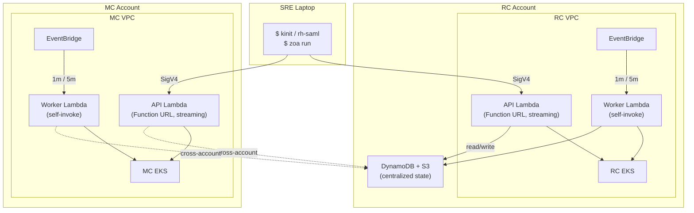
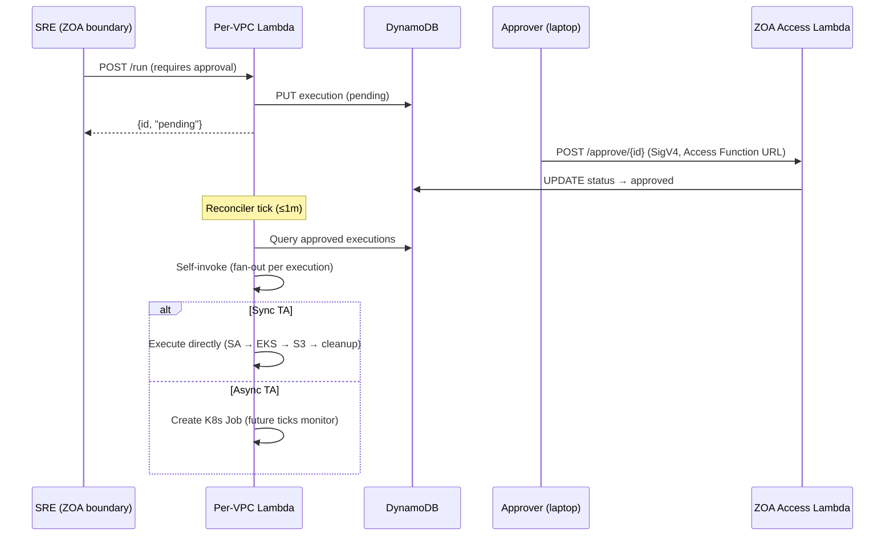

# Zero Operator Access (ZOA) — Architecture

**Last Updated Date**: 2026-10-02

## Summary

ZOA ensures that operators have **no persistent, interactive, or unaudited access** to customer infrastructure. All operational actions are executed through pre-defined, audited Trusted Actions (TAs) via a fully serverless execution engine (Lambda, DynamoDB, S3, EventBridge).

ZOA is independent of the Regional Cluster's Platform API or any Kubernetes workload — the tool to fix the platform does not depend on the platform being healthy.

> For code-level architecture details (execution flows, SA isolation, streaming adapter, TA development), see the [ZOA repository documentation](https://github.com/openshift-online/rosa-hyperfleet-zoa/blob/main/README.md).

## Context

- **Problem Statement**: Traditional managed-service operations require operators to have standing access (kubeconfig, IAM roles, bastion hosts). This creates unaudited access paths, persistent credentials, no accountability, and compliance gaps. FedRAMP requires complete audit trails for all privileged operations.
- **Failure Domain Minimization**: The tool used to fix the platform must not depend on the platform being healthy. For sync TAs (the common case), the execution path has 3 failure domains — all AWS-managed: Lambda, DynamoDB, EKS API server. No custom K8s workloads, no pods, no operators in the critical path. Lambdas deploy per-VPC to isolate failure domains — one cluster's ZOA outage cannot cascade to another.
- **Constraints**: Lambda only admits ECR as image source; Function URLs require IAM auth; cross-account access must use STS AssumeRole; all data encrypted at rest (KMS).
- **Assumptions**: Each target VPC has an EKS cluster reachable from the Lambda's subnet. DynamoDB is the shared state store (regional, in RC account). CLI authenticates via SigV4.

## Architecture

**Composite sync availability: 99.95%** (~22 min/month downtime budget). The sync execution path has only 3 failure domains — all AWS-managed: Lambda (99.95%), DynamoDB (99.999%), and EKS API (99.95%). No custom K8s workloads, no pods, no operators in the critical path.

Each target VPC (RC and every MC) gets an independent pair of Lambda functions from the same container image (`zoa-lambda`), differentiated by the `HANDLER_MODE` environment variable:

| Lambda     | Invoke Mode       | Trigger                             | Purpose                                                           | Timeout | Concurrency |
| ---------- | ----------------- | ----------------------------------- | ----------------------------------------------------------------- | ------- | ----------- |
| **API**    | `RESPONSE_STREAM` | Function URL (IAM auth)             | HTTP handler for CLI, sync TA execution, streaming responses      | 300s    | 50          |
| **Worker** | `BUFFERED`        | EventBridge Scheduler + self-invoke | Reconciler (1m), GC (5m), boundary reaper (5m), async/approved TA | 300s    | 10          |
| **Access** | `BUFFERED`        | Function URL (IAM auth)             | Boundary session lifecycle, target discovery (RC, no VPC)         | 300s    | (module)    |

Both use `lambda.Start()` from `aws-lambda-go`. The API Lambda uses a native Go streaming adapter (`LambdaFunctionURLStreamingResponse`) supporting responses up to 200MB — no external proxy or sidecar. The Worker uses standard JSON responses for EventBridge and self-invocation events.



> For the complete architecture diagram including all component interactions, see the [ZOA README — Architecture](https://github.com/openshift-online/rosa-hyperfleet-zoa/blob/main/README.md#architecture).

### Authentication & Caller Boundaries

#### Per-VPC API Lambda (Trusted Actions)

SREs inside a **ZOA boundary** container call the local per-VPC API Lambda Function URL (`ZOA_API_URL`, IAM auth). The ECS task role provides SigV4 identity; the API Lambda records caller ARN on every execution and (for boundary tasks) resolves the originating SRE via the identity bridge (task UUID → DynamoDB session).

Operators with laptop credentials that can invoke the API Function URL directly may still run `zoa run` against RC/MC endpoints for development and platform recovery — the resource policy controls who may invoke. Production investigations should use boundary sessions so shell I/O is captured in CloudWatch Exec logs.

#### ZOA Access Lambda + ZOA boundary (sessions)

Two authentication domains separate **session management** from **TA execution**:

```
SRE Laptop                                      ZOA boundary (ECS task in target VPC)
    │                                                       │
    │ Central Account → invoker role                        │ ECS task IAM role
    │ (Function URL SigV4)                                  │ (injected at RunTask)
    │                                                       │
    ▼                                                       ▼
ZOA Access Function URL                         Per-VPC API Function URL
(IAM auth, RC Lambda, no VPC)                   (IAM auth, VPC-attached)
    │                                                       │
    │ Invoker role + resource policy                        │ ZOA boundary task roles only
    │                                                       │
    ▼                                                       ▼
ZOA Access Lambda                               API Lambda (same VPC)
(sessions, RunTask, discovery)                  (TA execution)
```

**From laptop** (session management):

1. Authenticate to the Central Account and assume the ZOA Access **invoker** role (same pattern as other HyperFleet central roles).
2. `zoa session start <deployment> <target>` — positional args, e.g. `zoa session start us-east-1 mc01` (flags `-d`/`-t` for scripts).
3. CLI calls the **ZOA Access Function URL** (discovered via SSM / config), not API Gateway.
4. Access Lambda runs `ecs:RunTask` in the target VPC (cross-account for MC), sets `ZOA_API_URL`, enables ECS Exec.
5. `zoa session join <deployment>/<session-id>` opens an interactive shell (ECS Exec + `session-manager-plugin`).

**From ZOA boundary** (TA operations):

1. SRE works in the ECS Exec shell.
2. `zoa run …` uses `ZOA_API_URL` → per-VPC API Lambda Function URL.
3. API Lambda validates the caller against the boundary task role for that VPC.

**Session enforcement:** Worker Lambda **reaper** (EventBridge every 5m, `route=reaper`) terminates boundary tasks when the session deadline passes (`pkg/scheduler/reaper.go`).

This separation means a compromised invoker role cannot execute arbitrary TAs against cluster APIs without a boundary task — it can only manage sessions. A boundary task role can reach only its VPC's API Lambda.

Session logging: container stdout → `/ecs/<cluster_id>/zoa-boundary`; ECS Exec transcripts → `.../zoa-boundary/ssm-sessions` (see [boundary session logging](https://github.com/openshift-online/rosa-hyperfleet-zoa/blob/main/docs/design/boundary-session-logging.md) in the ZOA repo).

### Execution Modes (Sync vs Async)

Each Trusted Action declares its execution mode. The mode determines how the TA runs and where output is generated:

|                       | Sync                                                       | Async                                                                           |
| --------------------- | ---------------------------------------------------------- | ------------------------------------------------------------------------------- |
| **Executor**          | API Lambda (inline) or self-invoked Worker Lambda          | K8s Job (`zoa-runner` container) on target EKS                                  |
| **Output delivery**   | Streamed in Lambda response (up to 200MB) + archived to S3 | Written to S3 by the Job; retrieved via API Lambda streaming (same 200MB limit) |
| **Use case**          | Read operations, quick mutations (seconds)                 | Long-running operations, large outputs, needs its own pod lifecycle             |
| **Timeout**           | Bounded by Lambda timeout (300s)                           | Bounded by K8s Job `activeDeadlineSeconds` (configurable per TA)                |
| **CLI experience**    | Blocks until complete, streams output                      | Returns immediately with execution ID; poll with `zoa get` or `--wait`          |
| **Output size limit** | 200MB (Lambda streaming)                                   | 200MB (retrieved via API Lambda streaming; S3 stores the full artifact)         |

Both modes create per-execution K8s RBAC (ServiceAccount + Role + RoleBinding) that is destroyed after completion. For `kube-api` scope TAs, the Lambda uses SA impersonation (`rest.ImpersonationConfig`) so the K8s audit log reflects only the declared RBAC — not the Lambda's own broad permissions. For async mode, a scoped STS Secret is also created (S3 upload-only credentials restricted to the execution's prefix via session policy). For `aws-api` scope TAs, dedicated IAM roles (`zoa-aws-read` / `zoa-aws-write`) are assumed per-execution via STS with a session policy scoped to the specific TA's declared permissions.

> For full sequence diagrams of both modes, see [Implementation Details](https://github.com/openshift-online/rosa-hyperfleet-zoa/blob/main/docs/architecture/implementation.md).

### Per-VPC Isolation

Each cluster's ZOA is fully independent. A failure in one VPC cannot cascade — no cross-VPC networking, no shared control plane in the execution path. Blast radius = 1 cluster.

### Self-Invocation (Worker Fan-Out)

The Worker Lambda invokes **itself** to dispatch approved TA executions. Each self-invocation handles exactly one execution in its own concurrent slot:

1. Reconciler tick (every 1m) queries DynamoDB for `status=approved` executions
2. Atomically transitions each to `status=dispatched` (conditional write prevents double-dispatch)
3. Self-invokes once per execution with `InvocationType=Event` (async, fire-and-forget):
   ```json
   { "route": "execute", "execution_id": "abc123" }
   ```
4. AWS Lambda queues each invocation and executes it in a separate concurrent slot
5. The new Lambda instance then operates based on the TA's execution mode:
   - **Sync mode**: Creates SA + RBAC → impersonates SA → executes TA directly against EKS API → uploads output to S3 → cleans up K8s resources → updates DynamoDB. All within one Lambda invocation.
   - **Async mode**: Creates SA + RBAC + STS Secret (scoped S3 upload credentials) + K8s Job → updates DynamoDB to `running` → returns. Future reconciler ticks monitor the Job status, update DynamoDB on completion, and clean up K8s resources.

`reserved_concurrency=10` ensures max 9 concurrent TA executions + 1 slot reserved for the reconciler/GC tick. Excess invocations queue in Lambda's internal retry queue (up to 6 hours). This avoids SQS complexity while maintaining concurrency control and backpressure.

### DLQ Semantics

The SQS dead-letter queue (SSE-SQS encrypted, 14-day retention) is only effective for the **Worker** Lambda:

- EventBridge and self-invoke are async — failures land in the DLQ after retry exhaustion
- The API Lambda returns errors directly to the caller (429/5xx) — DLQ cannot capture synchronous Function URL failures

### Response Streaming

The API Lambda uses native Go response streaming (`LambdaFunctionURLStreamingResponse`) via a custom adapter in `pkg/lambdahttp/`. This:

- Converts Function URL events to standard `net/http` requests
- Passes them through the Go HTTP router
- Returns streaming responses up to 200MB (bypasses the 6MB synchronous Lambda limit)
- Uses no external binaries or sidecars (pure Go, UBI-minimal base image)

## Terraform Modules

```
terraform/modules/zoa/          → Regional data layer (one per region, lives in RC account)
                                  DynamoDB, S3, KMS, ECR, IAM roles

terraform/modules/zoa-lambda/   → Per-VPC compute (one per target VPC: RC + each MC)
                                  Lambdas, EventBridge, SQS DLQ, CloudWatch Logs, EKS access
```

### `modules/zoa/` — Regional Shared Data Layer

| Resource              | Details                                                                                                                                                                      |
| --------------------- | ---------------------------------------------------------------------------------------------------------------------------------------------------------------------------- |
| DynamoDB (executions) | PK=executionId, 4 GSIs (account-index, status-index, target-index, target-status-index). On-demand billing, PITR enabled, deletion protection (disabled for ephemeral envs). |
| DynamoDB (audit)      | PK=accountId, SK=timestamp (nanosecond precision for uniqueness). Every audited API call.                                                                                    |
| S3 bucket             | `zoa-artifacts-{region}`. KMS-SSE, versioning, lifecycle (Intelligent-Tiering 30d, expire 365d). Stores output.json and execution.log per execution.                         |
| KMS key               | Symmetric key for DynamoDB + S3 encryption at rest. Key policy allows Lambda execution roles and cross-account MC roles.                                                     |
| ECR repository        | Hosts `zoa-lambda` images mirrored from Quay via skopeo. Lifecycle retains last 20 images. Cross-account pull policy scoped to MC OU path.                                   |
| IAM: zoa-uploader     | Scoped `s3:PutObject` + `kms:GenerateDataKey` for async runner K8s Jobs. Assumed via STS from runner pods.                                                                   |
| IAM: zoa-data-access  | Cross-account role for MC Lambdas to reach RC's DynamoDB and S3. Trust policy scoped to MC account OU.                                                                       |

### `modules/zoa-lambda/` — Per-VPC Compute

| Resource                    | Details                                                                                                                                                                          |
| --------------------------- | -------------------------------------------------------------------------------------------------------------------------------------------------------------------------------- |
| API Lambda                  | Function URL (`AWS_IAM` auth type), invoke mode `RESPONSE_STREAM`, x86_64 container from ECR, VPC-attached to private subnets, 512MB memory.                                     |
| Worker Lambda               | No Function URL. EventBridge-triggered + self-invoke. Same image, VPC, memory.                                                                                                   |
| IAM execution role (shared) | Single role for both Lambdas: DynamoDB read/write, S3 read/write, EKS describe, STS AssumeRole (for TA-scoped roles + uploader), Lambda self-invoke, CloudWatch Logs.            |
| IAM: zoa-aws-read           | Per-TA scoped role for AWS read operations (EKS DescribeCluster, EC2 DescribeInstances/VPCs/Subnets/SecurityGroups). Assumed per-execution via STS.                              |
| IAM: zoa-aws-write          | Per-TA scoped role for AWS write operations. Grows incrementally as write TAs are added.                                                                                         |
| SQS DLQ                     | Dead letters for Worker async failures. SSE-SQS, 14-day retention. One per Lambda pair.                                                                                          |
| CloudWatch Logs             | Log groups with 365-day retention, KMS-encrypted (customer-managed key, consistent with platform standard). JSON structured logging.                                             |
| EKS access entry            | Grants Lambda execution role access to target EKS cluster with a Kubernetes group for RBAC binding.                                                                              |
| Security group              | Egress to EKS API (443) and AWS service endpoints. No inbound rules (Function URL handles ingress).                                                                              |
| EventBridge Scheduler       | Four schedules on Worker: reconciler (1m), GC (5m), boundary reaper (5m), plus self-invoke for TA execution. Reaper requires `sessions_table_name` and boundary ECS cluster ARN. |

### `modules/zoa-access/` — Session control plane (RC)

| Resource       | Details                                                                                                    |
| -------------- | ---------------------------------------------------------------------------------------------------------- |
| Access Lambda  | Same `zoa-lambda` image, `HANDLER_MODE=access`, no VPC. Function URL with `AWS_IAM` auth (no API Gateway). |
| Invoker role   | Central-trusted role; SREs assume via Central Account to call the Function URL.                            |
| SSM parameters | Publishes Access Function URL and deployment metadata for CLI autodiscovery.                               |

### `modules/zoa-boundary/` — Investigation containers (RC + MC VPC)

Deployed in **each** target VPC (RC + every MC). Operator workflows, session model, and container contents are documented in the [ZOA repo — Boundary](https://github.com/openshift-online/rosa-hyperfleet-zoa/blob/main/docs/boundary/README.md).

| Resource                      | Details                                                                                                                                                                                   |
| ----------------------------- | ----------------------------------------------------------------------------------------------------------------------------------------------------------------------------------------- |
| ECS cluster + task definition | Fargate `zoa-boundary` image, ECS Exec, shared regional ZOA CMK (`kms_key_arn`).                                                                                                          |
| CloudWatch Logs               | `/ecs/<cluster_id>/zoa-boundary` + `.../ssm-sessions` (see [session logging](https://github.com/openshift-online/rosa-hyperfleet-zoa/blob/main/docs/design/boundary-session-logging.md)). |
| Bedrock                       | Task IAM + optional `aws_bedrock_foundation_model_agreement` and account Bedrock budget (module defaults; see `terraform/modules/zoa-boundary/README.md`).                                |
| VPC                           | Uses shared `terraform/modules/vpc` endpoints (S3, DynamoDB, KMS, SSM/Exec, bedrock-runtime).                                                                                             |

### RC/MC Config Wiring

- **RC** instantiates `modules/zoa`, `modules/zoa-lambda`, `modules/zoa-access`, and `modules/zoa-boundary` (RC VPC). Exports data-access role ARN and ECR URL as outputs for MC consumption.
- **MC** instantiates `modules/zoa-lambda` and `modules/zoa-boundary`, consuming RC outputs (ECR URL, DynamoDB, S3, KMS, data-access role, sessions table, Access metadata).
- **Cross-account access**: MC Lambdas assume `zoa-data-access` role via STS to reach RC's DynamoDB and S3. Both DynamoDB tables and S3 bucket also have resource-based policies scoped by MC OU path — defense in depth (either mechanism alone would suffice).

### AWS cost allocation tags (ZOA)

All ZOA Terraform modules set **`Component=zoa`** and **`function=zoa`** on taggable resources (in addition to provider **`default_tags`**: `app-code`, `service-phase`, `cost-center`, `environment`). Modules: `zoa`, `zoa-lambda`, `zoa-access`, `zoa-boundary`. Central-account SSM deployment discovery uses the **`aws.central`** provider with the same org **`default_tags`**.

Access Lambda sets **`Component`** and **`function`** on boundary **ECS tasks** at `RunTask` (with session attribution tags). Activate these keys as cost allocation tags in AWS Billing for per-component reports.

## Tunable Parameters

All configuration is via Terraform variables that map to Lambda environment variables — no code changes or redeployment required beyond `terraform apply`:

| Variable                      | Default | Lambda Env Var                | Purpose                                             |
| ----------------------------- | ------- | ----------------------------- | --------------------------------------------------- |
| `lambda_api_timeout`          | 300     | (Lambda config)               | API Lambda hard ceiling (seconds)                   |
| `lambda_worker_timeout`       | 300     | (Lambda config)               | Worker Lambda hard ceiling (seconds)                |
| `lambda_api_concurrency`      | 50      | (Lambda config)               | Max concurrent API invocations                      |
| `lambda_worker_concurrency`   | 10      | (Lambda config)               | Max concurrent Worker invocations                   |
| `reconciler_deadline_seconds` | 55      | `RECONCILER_DEADLINE_SECONDS` | Code-level deadline for reconciler/GC ticks         |
| `max_batch_per_tick`          | 30      | `MAX_BATCH_PER_TICK`          | Items processed per scheduled phase per tick        |
| `lambda_memory_size`          | 512     | (Lambda config)               | Memory in MB (CPU scales proportionally)            |
| `dynamodb_ttl_days`           | 365     | `DYNAMODB_TTL_DAYS`           | Record retention (FedRAMP: minimum 365 days)        |
| `write_cooldown_seconds`      | 300     | `WRITE_COOLDOWN_SECONDS`      | Per-target rate limit between same write TA         |
| `max_concurrent_per_target`   | 10      | `MAX_CONCURRENT_PER_TARGET`   | Max parallel pending+running executions per target  |
| `log_level`                   | info    | `LOG_LEVEL`                   | Structured log verbosity (debug, info, warn, error) |

## Security Model

| Layer                  | Mechanism                                                                                                                                                                                                                               |
| ---------------------- | --------------------------------------------------------------------------------------------------------------------------------------------------------------------------------------------------------------------------------------- |
| API authentication     | Function URL with `AWS_IAM` auth type — requires valid SigV4 signature from caller                                                                                                                                                      |
| Caller identity        | Extracted from SigV4: Account ID, Caller ARN, operator name (from session name). Recorded on every execution.                                                                                                                           |
| Network isolation      | Lambda runs inside the target VPC (private subnets only). No public endpoints.                                                                                                                                                          |
| Cross-account data     | STS AssumeRole (identity-based) + resource-based policies on DynamoDB/S3 (defense in depth)                                                                                                                                             |
| TA-scoped permissions  | Separate `zoa-aws-read` and `zoa-aws-write` IAM roles assumed per execution via STS session policy                                                                                                                                      |
| K8s RBAC per execution | Per-execution ServiceAccount (`zoa-runner-<exec-id>`) with minimal Role from TA template                                                                                                                                                |
| Encryption at rest     | KMS for DynamoDB + S3 + CloudWatch Logs; SQS server-side encryption (SSE-SQS) for DLQ                                                                                                                                                   |
| Audit trail            | Every API call → DynamoDB audit table. Every execution → DynamoDB executions table. Logs → CloudWatch (365d).                                                                                                                           |
| Jira enforcement       | Every execution requires a Jira ticket ID. Validated at API level (format: `PROJECT-123`).                                                                                                                                              |
| EKS circuit breaker    | Trips after 3 consecutive EKS API failures within 30s; fast-fails for 60s to prevent timeout exhaustion. See [`circuit_breaker.go`](https://github.com/openshift-online/rosa-hyperfleet-zoa/blob/main/pkg/executor/circuit_breaker.go). |

For the full security model (threat model, SA isolation strategies, RBAC design), see [Implementation Details](https://github.com/openshift-online/rosa-hyperfleet-zoa/blob/main/docs/architecture/implementation.md) in the ZOA repository.

## Deployment Flow

```
Konflux/Tekton → builds container image (x86_64, UBI-minimal)
     │
     ▼
Quay registry (quay.io/redhat-user-workloads/rosa-tenant/zoa-lambda:<commit-sha>)
     │
     ▼ (pipeline step: skopeo mirror — temporary until Konflux pushes to ECR directly)
ECR repository (in RC account, cross-account pull policy for MC accounts)
     │
     ▼ (Terraform variables: zoa_lambda_image_tag / zoa_runner_image_tag)
terraform apply → updates Lambda functions and K8s Job runner to use new images
```

**Rollback**: Set `zoa_lambda_image_tag` (and/or `zoa_runner_image_tag`) to a previous commit SHA and `terraform apply`. Lambda picks up the ECR image immediately on next cold start. No draining, no rolling update — existing warm instances continue until their next invocation timeout.

## Observability

| Signal                   | Source               | Status    | How                                                                                          |
| ------------------------ | -------------------- | --------- | -------------------------------------------------------------------------------------------- |
| Invocation errors        | AWS/Lambda namespace | Available | YACE scrape → Prometheus/Thanos; Grafana **Lambda** + **ZOA** dashboards                     |
| Duration P50/P99         | AWS/Lambda namespace | Available | YACE `Duration` Average + p99                                                                |
| Throttles / concurrency  | AWS/Lambda namespace | Available | YACE `Throttles`, `ConcurrentExecutions`                                                     |
| DLQ depth                | AWS/SQS              | Available | YACE `ApproximateNumberOfMessagesVisible` on `*-zoa-dlq`; pages if > 0 for 5m                |
| Business metrics         | ZOA custom namespace | Available | EMF from Go (`ExecutionCount`, HTTP, rejections, reconciler/GC, circuit breaker)             |
| Execution outcomes       | DynamoDB             | Available | Queryable via `zoa runs --status failed --target X` (forensics, not SLIs)                    |
| Logs                     | CloudWatch Logs      | Available | 365-day retention, JSON structured, filterable via CW Insights                               |
| CW Exporter → Prometheus | YACE on RC + MC      | Available | Discovery: `AWS/Lambda`, `AWS/SQS`; top-level `customNamespace` job for `ZOA`                |
| PrometheusRules alerting | Thanos Ruler (RC)    | Available | `alerting-rules/templates/zoa.yaml` — DLQ, worker errors, reconciler heartbeat, TA/API rates |

Two Grafana dashboards: **Lambda** (infrastructure) and **ZOA** (unified service view with SLO panels, activity breakdowns, per-TA drill-down, and worker pipeline health).

### Source of Truth

| What                         | Location                                                                                                          |
| ---------------------------- | ----------------------------------------------------------------------------------------------------------------- |
| Recording rules and alerts   | [`alerting-rules/templates/zoa.yaml`](../../argocd/config/regional-cluster/alerting-rules/templates/zoa.yaml)     |
| Dashboard                    | [`grafana/dashboards/zoa/zoa.json`](../../argocd/config/regional-cluster/grafana/dashboards/zoa/zoa.json)         |
| YACE scrape config (RC)      | [`cloudwatch-exporter/values.yaml` (RC)](../../argocd/config/regional-cluster/cloudwatch-exporter/values.yaml)    |
| YACE scrape config (MC)      | [`cloudwatch-exporter/values.yaml` (MC)](../../argocd/config/management-cluster/cloudwatch-exporter/values.yaml)  |
| EMF metrics catalog and logs | [ZOA observability docs](https://github.com/openshift-online/rosa-hyperfleet-zoa/blob/main/docs/observability.md) |

## Cost

| Component             | Pricing model                                         | Estimate (per cluster, moderate use) |
| --------------------- | ----------------------------------------------------- | ------------------------------------ |
| Lambda (API + Worker) | Per-ms execution + per-request ($0.20/1M). Zero idle. | < $5/month                           |
| DynamoDB (on-demand)  | $1.25/1M writes, $0.25/1M reads                       | < $2/month                           |
| S3 (artifacts)        | Standard + Intelligent-Tiering (30d) + expire (365d)  | < $1/month                           |
| EventBridge Scheduler | Free tier covers all schedules                        | $0                                   |
| CloudWatch Logs       | $0.50/GB ingested                                     | < $3/month                           |
| ECR                   | $0.10/GB stored                                       | < $0.50/month                        |
| **Total per VPC**     |                                                       | **< $12/month**                      |

Graviton/arm64 migration planned for ~20% Lambda cost reduction.

---

> Sections below describe features not yet implemented.

## Future Considerations

### Break-Glass Access

A `/breakglass/` API path will provide escalated access when normal TAs are insufficient:

- Requires multi-party approval (approver != requester, same SRE group)
- Uses `eks:CreateAccessEntry` (per-VPC Lambda, local, same account) to grant temporary cluster access
- Scopes: `kube-read`, `kube-write`, `kube-admin` (mapped to pre-deployed ClusterRoleBindings); `aws-read`, `aws-write`, `aws-admin` (STS-based)
- TTL starts at activation (reconciler), not at request time
- CLI verb: `zoa breakglass ...` (deliberately more typing to prevent muscle-memory accidents)
- Independent of RC health — runs on the same per-VPC Lambda infrastructure

### Approval Workflow

All current TAs declare `authorization.approval: none`. The data model supports future approval-gated TAs:



- States: `pending` → `approved` / `rejected` / `expired` (24h DynamoDB TTL)
- Approval policies: per-TA configuration (e.g., require 1 peer from on-call rotation)
- Notification: SNS → Slack/PagerDuty for approval requests
- Approver validation: approver != requester, same LDAP group, SigV4 identity verified

## Related Documentation

### In this repository

- Terraform modules: [`terraform/modules/zoa/`](../../terraform/modules/zoa/), [`terraform/modules/zoa-lambda/`](../../terraform/modules/zoa-lambda/), [`terraform/modules/zoa-access/`](../../terraform/modules/zoa-access/), [`terraform/modules/zoa-boundary/`](../../terraform/modules/zoa-boundary/)
- RC config: [`terraform/config/regional-cluster/`](../../terraform/config/regional-cluster/) (instantiates both modules)
- MC config: [`terraform/config/management-cluster/`](../../terraform/config/management-cluster/) (instantiates `zoa-lambda` only)

### In [`rosa-hyperfleet-zoa`](https://github.com/openshift-online/rosa-hyperfleet-zoa)

- [README](https://github.com/openshift-online/rosa-hyperfleet-zoa/blob/main/README.md) — Component overview, quick start, container images
- [Lambda Model](https://github.com/openshift-online/rosa-hyperfleet-zoa/blob/main/docs/architecture/lambda-model.md) — Handler modes, invoke modes, execution flow
- [Implementation Details](https://github.com/openshift-online/rosa-hyperfleet-zoa/blob/main/docs/architecture/implementation.md) — Streaming adapter, async execution, K8s Jobs, SA isolation
- [CLI Reference](https://github.com/openshift-online/rosa-hyperfleet-zoa/blob/main/docs/cli-reference.md) — All `zoa` CLI commands, flags, and usage examples
- [Trusted Actions Guide](https://github.com/openshift-online/rosa-hyperfleet-zoa/blob/main/docs/trusted-actions.md) — TA template format, CLI commands, API endpoints
- [Development Guide](https://github.com/openshift-online/rosa-hyperfleet-zoa/blob/main/docs/development.md) — Building, testing, local development
- [E2E Testing](https://github.com/openshift-online/rosa-hyperfleet-zoa/blob/main/docs/e2e-testing.md) — Functional and monitoring E2E suites, smoke vs full, CI integration
- [Observability](https://github.com/openshift-online/rosa-hyperfleet-zoa/blob/main/docs/observability.md) — EMF metrics catalog, cost model, Lambda logs, Grafana Explorer
- [API Reference](https://github.com/openshift-online/rosa-hyperfleet-zoa/blob/main/docs/api-reference.md) — Lambda Function URL HTTP API endpoints
- [ZOA Boundary documentation](https://github.com/openshift-online/rosa-hyperfleet-zoa/blob/main/docs/boundary/README.md) — architecture, SRE access, container image (source of truth)
- [Boundary session logging](https://github.com/openshift-online/rosa-hyperfleet-zoa/blob/main/docs/design/boundary-session-logging.md) — CloudWatch log groups for container vs ECS Exec
- [Konflux](https://github.com/openshift-online/rosa-hyperfleet-zoa/blob/main/docs/konflux.md) — Container image build pipeline
