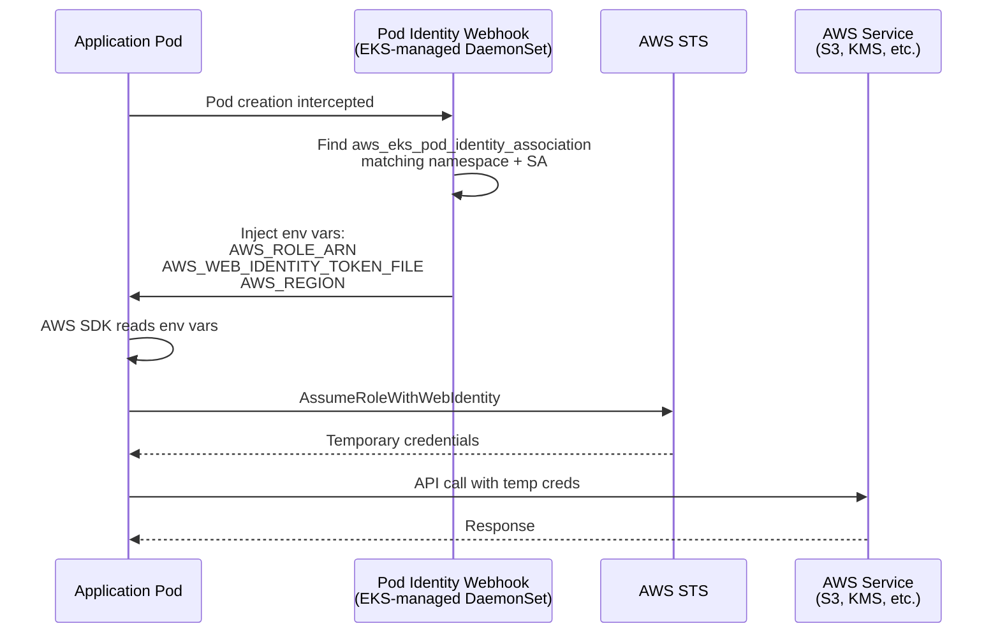

# Complete IRSA to Pod Identity Migration Implementation Plan

> **For agentic workers:** REQUIRED SUB-SKILL: Use superpowers:subagent-driven-development (recommended) or superpowers:executing-plans to implement this plan task-by-task. Steps use checkbox (`- [ ]`) syntax for tracking.

**Goal:** Remove the last IRSA annotation from the codebase (Thanos service account) and document the platform-wide Pod Identity architecture.

**Architecture:** This is a cleanup task. Pod Identity associations already exist in Terraform for all Thanos components. The IRSA annotation is ignored by EKS (Pod Identity takes precedence) and causes confusion. We remove the annotation and document the platform standard.

**Tech Stack:** Kubernetes ServiceAccount manifests, Helm charts, Terraform (verification only), Markdown documentation

## Global Constraints

- All markdown must be formatted with prettier (`npx prettier --write '**/*.md'`)
- Helm charts must pass `make helm-lint`
- All changes must pass `make pre-push` before committing
- Zero downtime: changes deploy via ArgoCD GitOps sync
- No Terraform changes: Pod Identity associations already exist

---

## File Structure

### Files to Modify

1. **`argocd/config/regional-cluster/thanos/templates/serviceaccount.yaml`**
   - Remove lines 10-13 (conditional IRSA annotation block)
   - Keep the file structure intact with empty annotations handling

2. **`argocd/config/regional-cluster/thanos/values.yaml`**
   - No changes needed (already has `annotations: {}`)
   - Verification only

### Files to Create

3. **`docs/design/pod-identity-migration.md`**
   - Platform-wide Pod Identity architecture ADR
   - Migration history and rationale
   - Standard implementation pattern

---

## Task 1: Pre-Migration Verification

**Files:**

- Verify: `terraform/modules/thanos-infrastructure/main.tf`
- Verify: `argocd/config/regional-cluster/thanos/templates/serviceaccount.yaml`

**Interfaces:**

- Consumes: None (verification task)
- Produces: Confirmation that Pod Identity infrastructure exists before annotation removal

**Purpose:** Verify Pod Identity associations exist in Terraform before removing IRSA annotation. This prevents a credential gap scenario.

- [ ] **Step 1: Verify Pod Identity associations exist in Terraform**

Run:

```bash
grep -A 5 "resource \"aws_eks_pod_identity_association\"" terraform/modules/thanos-infrastructure/main.tf | grep -E "thanos_receiver|thanos_store|thanos_compact|thanos_ruler|thanos_receive_ingester"
```

Expected output: 5 Pod Identity association resource blocks

- [ ] **Step 2: Verify current IRSA annotation exists**

Run:

```bash
grep -A 3 "eks.amazonaws.com/role-arn" argocd/config/regional-cluster/thanos/templates/serviceaccount.yaml
```

Expected output:

```yaml
eks.amazonaws.com/role-arn:
  {
    {
      printf "arn:%s:iam::%s:role/%s-thanos" $partition .Values.global.aws_account_id .Values.global.cluster_name | quote,
    },
  }
```

- [ ] **Step 3: Verify values.yaml has empty annotations**

Run:

```bash
grep -A 2 "serviceAccount:" argocd/config/regional-cluster/thanos/values.yaml | grep "annotations"
```

Expected output:

```yaml
annotations: {}
```

- [ ] **Step 4: Document verification results**

Create a temporary verification note:

```bash
echo "Pre-migration verification complete:
- Pod Identity associations: EXISTS (5 found)
- IRSA annotation: EXISTS (to be removed)
- values.yaml annotations: EMPTY (correct)" > /tmp/pod-identity-verification.txt
cat /tmp/pod-identity-verification.txt
```

Expected: Verification summary displayed

---

## Task 2: Remove IRSA Annotation from Thanos ServiceAccount

**Files:**

- Modify: `argocd/config/regional-cluster/thanos/templates/serviceaccount.yaml:10-13`

**Interfaces:**

- Consumes: Verification from Task 1 (Pod Identity associations exist)
- Produces: Clean ServiceAccount template with no IRSA annotation

**Purpose:** Remove the stale IRSA annotation that's ignored by EKS when Pod Identity is active.

- [ ] **Step 1: Read current serviceaccount.yaml**

Run:

```bash
cat argocd/config/regional-cluster/thanos/templates/serviceaccount.yaml
```

Expected: File contains 17 lines including IRSA annotation block on lines 10-13

- [ ] **Step 2: Remove IRSA annotation block (lines 10-13)**

Edit `argocd/config/regional-cluster/thanos/templates/serviceaccount.yaml`:

Remove these lines:

```yaml
    {{- if .Values.global.aws_account_id }}
    {{- $partition := ternary "aws-us-gov" "aws" (hasPrefix "us-gov-" .Values.global.aws_region) }}
    eks.amazonaws.com/role-arn: {{ printf "arn:%s:iam::%s:role/%s-thanos" $partition .Values.global.aws_account_id .Values.global.cluster_name | quote }}
    {{- end }}
```

The file should look like:

```yaml
apiVersion: v1
kind: ServiceAccount
metadata:
  name: {{ .Values.serviceAccount.name }}
  namespace: {{ include "thanos-operator.namespace" . }}
  labels:
    {{- include "thanos-operator.labels" . | nindent 4 }}
  annotations:
    {{- include "thanos-operator.annotations" . | nindent 4 }}
    {{- with .Values.serviceAccount.annotations }}
    {{- toYaml . | nindent 4 }}
    {{- end }}
```

- [ ] **Step 3: Verify no IRSA annotation remains**

Run:

```bash
grep -i "eks.amazonaws.com/role-arn" argocd/config/regional-cluster/thanos/templates/serviceaccount.yaml
```

Expected: No output (exit code 1)

- [ ] **Step 4: Validate Helm chart renders correctly**

Run:

```bash
make helm-lint
```

Expected output: All charts pass lint, no errors

- [ ] **Step 5: Verify no other IRSA annotations exist**

Run:

```bash
grep -r "eks.amazonaws.com/role-arn" argocd/ terraform/ --include="*.yaml" --include="*.tf"
```

Expected: No output (exit code 1) - this was the last IRSA annotation

- [ ] **Step 6: Commit the annotation removal**

```bash
git add argocd/config/regional-cluster/thanos/templates/serviceaccount.yaml
git commit -m "feat: remove IRSA annotation from Thanos service account

Pod Identity associations already exist in Terraform for all 5 Thanos
service accounts (receiver, store, compact, ruler, ingester). The IRSA
annotation is ignored by EKS when Pod Identity is active (Pod Identity
takes precedence).

This completes the platform's migration to Pod Identity as the single
authentication mechanism for all AWS IAM workloads.

Refs: docs/superpowers/specs/2026-08-12-pod-identity-migration-design.md

Co-Authored-By: Claude Sonnet 4.5 <noreply@anthropic.com>"
```

---

## Task 3: Create Pod Identity Migration Documentation

**Files:**

- Create: `docs/design/pod-identity-migration.md`

**Interfaces:**

- Consumes: Thanos annotation removal from Task 2
- Produces: Platform-wide Pod Identity architecture ADR

**Purpose:** Document the platform's Pod Identity standard, migration history, and implementation patterns for future reference.

- [ ] **Step 1: Create Pod Identity migration ADR**

Create `docs/design/pod-identity-migration.md`:

````markdown
# EKS Pod Identity Migration

**Last Updated Date**: 2026-08-12

## Summary

The ROSA HyperFleet platform uses EKS Pod Identity exclusively for all AWS IAM authentication. IRSA (IAM Roles for Service Accounts) has been fully removed from platform infrastructure.

This document explains why Pod Identity is the platform standard, documents the migration timeline, and provides reference implementation patterns.

## Context

### Why Pod Identity Over IRSA

EKS Pod Identity is simpler and more maintainable than IRSA:

| Aspect                    | IRSA                                         | Pod Identity                          |
| ------------------------- | -------------------------------------------- | ------------------------------------- |
| **Terraform**             | OIDC provider, tls_certificate, tls provider | Just role + association               |
| **Service Account**       | Annotation with role ARN                     | No annotation needed                  |
| **Helm Values**           | Must inject role ARN from Terraform          | No Helm values needed                 |
| **Trust Policy**          | Complex OIDC conditions (issuer, aud, sub)   | Simple `pods.eks.amazonaws.com`       |
| **Debugging**             | Trace annotation → values → Terraform        | `kubectl describe pod` shows env vars |
| **Scope**                 | Namespace-level                              | Namespace + ServiceAccount            |
| **CloudTrail Visibility** | Only IAM role ARN                            | Pod namespace, SA, cluster name       |

### Migration Timeline

| Date       | Component  | Commit   | Change                                     |
| ---------- | ---------- | -------- | ------------------------------------------ |
| 2026-08-12 | Karpenter  | 8b9a3661 | IRSA → Pod Identity, removed OIDC provider |
| 2026-08-12 | Thanos     | (this)   | Remove stale IRSA annotation               |
| Prior      | All others | Various  | 30+ Pod Identity associations              |

All platform controllers now use Pod Identity:

- Thanos (receiver, store, compact, ruler, ingester)
- Karpenter
- AWS Load Balancer Controller
- EBS CSI Driver
- kube-applier
- external-dns
- cert-manager
- Loki forwarder
- Prometheus remote write
- CloudWatch exporter
- Grafana CloudWatch logs
- ZOA jobs
- Platform API authz

## Standard Implementation Pattern

Every module that needs AWS IAM authentication follows this pattern:

### 1. IAM Role with Pod Identity Trust Policy

```hcl
resource "aws_iam_role" "example" {
  name = "${var.cluster_id}-example"

  assume_role_policy = jsonencode({
    Version = "2012-10-17"
    Statement = [{
      Effect = "Allow"
      Principal = {
        Service = "pods.eks.amazonaws.com"
      }
      Action = [
        "sts:AssumeRole",
        "sts:TagSession"
      ]
    }]
  })

  tags = {
    Name = "${var.cluster_id}-example"
  }
}
```
````

### 2. IAM Role Policy (Permissions)

```hcl
resource "aws_iam_role_policy" "example" {
  name = "example-permissions"
  role = aws_iam_role.example.id

  policy = jsonencode({
    Version = "2012-10-17"
    Statement = [
      {
        Effect = "Allow"
        Action = [
          "s3:GetObject",
          "s3:PutObject"
        ]
        Resource = "arn:aws:s3:::bucket-name/*"
      }
    ]
  })
}
```

### 3. Pod Identity Association (Binding)

```hcl
resource "aws_eks_pod_identity_association" "example" {
  cluster_name    = var.eks_cluster_name
  namespace       = "example-namespace"
  service_account = "example-sa"
  role_arn        = aws_iam_role.example.arn

  tags = {
    Name = "${var.cluster_id}-example"
  }
}
```

### 4. ServiceAccount (Helm Chart)

```yaml
apiVersion: v1
kind: ServiceAccount
metadata:
  name: example-sa
  namespace: example-namespace
# NO annotations needed - Pod Identity association handles authentication
```

## How Pod Identity Works



## Reference Implementations

### Simple Pattern (Single ServiceAccount)

See: `terraform/modules/authz/iam.tf`

- One IAM role
- One Pod Identity association
- One ServiceAccount in Helm chart

### Multi-ServiceAccount Pattern

See: `terraform/modules/thanos-infrastructure/main.tf`

- Two IAM roles (read-write, read-only)
- Five Pod Identity associations (one per component SA)
- ServiceAccounts created by thanos-community operator

### Cross-Account AssumeRole Pattern

See: `terraform/modules/dns-pod-identity/main.tf`

- Local Pod Identity role (MC-side)
- Inline policy granting `sts:AssumeRole` to RC role
- Used for cross-account DNS operations

## Debugging Pod Identity

### Verify Pod Identity Association Exists

```bash
aws eks list-pod-identity-associations --cluster-name <cluster-name>
```

### Check Pod Has Injected Credentials

```bash
kubectl get pod <pod-name> -n <namespace> -o yaml | grep AWS_
```

Expected env vars:

- `AWS_ROLE_ARN`
- `AWS_WEB_IDENTITY_TOKEN_FILE`
- `AWS_REGION`

### Verify Role Assumption Works

```bash
kubectl exec -it <pod-name> -n <namespace> -- aws sts get-caller-identity
```

Should show assumed role ARN.

### Check CloudTrail for AssumeRole Events

```bash
aws cloudtrail lookup-events \
  --lookup-attributes AttributeKey=EventName,AttributeValue=AssumeRole \
  --max-results 10
```

Pod Identity events include `eks:eks-cluster-name`, `eks:namespace`, `eks:service-account-name` in session tags.

## Migration Checklist (Historical)

When migrating a component from IRSA to Pod Identity:

- [ ] Create `aws_iam_role` with `pods.eks.amazonaws.com` trust policy
- [ ] Create `aws_eks_pod_identity_association` resource
- [ ] Remove `aws_iam_openid_connect_provider` if no longer used
- [ ] Remove `data.tls_certificate` if no longer used
- [ ] Remove `tls` provider from `versions.tf` if no longer used
- [ ] Remove IRSA annotation from ServiceAccount
- [ ] Remove role ARN from Helm values
- [ ] Remove role ARN output and threading (if applicable)
- [ ] Update design docs to reflect Pod Identity
- [ ] Test in ephemeral environment before production

## Related Documentation

- Karpenter Pod Identity migration (commit `8b9a3661`) - Documented Karpenter's IRSA → Pod Identity migration
- [Thanos Metrics Infrastructure](thanos-metrics-infrastructure.md) - Thanos architecture
- [Regional OIDC Ownership](regional-oidc-ownership.md) - Customer ROSA HCP cluster OIDC (separate from platform Pod Identity)
- AWS: [EKS Pod Identity](https://docs.aws.amazon.com/eks/latest/userguide/pod-identities.html)
- AWS: [Migrate from IRSA to Pod Identity](https://docs.aws.amazon.com/eks/latest/userguide/pod-id-abac.html#pod-id-abac-migrate)

````

- [ ] **Step 2: Format documentation with prettier**

Run:

```bash
npx prettier --write docs/design/pod-identity-migration.md
````

Expected: "Formatted 1 file"

- [ ] **Step 3: Verify markdown formatting**

Run:

```bash
make check-docs
```

Expected: Prettier passes with no formatting errors

- [ ] **Step 4: Verify Mermaid diagram syntax**

Check the sequence diagram manually renders correctly (line 97-114 in the doc):

```bash
grep -A 20 "sequenceDiagram" docs/design/pod-identity-migration.md
```

Expected: Valid Mermaid syntax (participant, ->>arrows, -->>responses)

- [ ] **Step 5: Commit Pod Identity migration documentation**

```bash
git add docs/design/pod-identity-migration.md
git commit -m "docs: add Pod Identity migration architecture ADR

Documents platform-wide Pod Identity architecture, migration timeline,
and standard implementation patterns.

- Why Pod Identity over IRSA (simpler, better debugging, tighter scope)
- Migration history (Karpenter, Thanos, 30+ prior migrations)
- Standard 4-step pattern (role, policy, association, ServiceAccount)
- Reference implementations (simple, multi-SA, cross-account)
- Debugging guide and CloudTrail visibility

Refs: docs/superpowers/specs/2026-08-12-pod-identity-migration-design.md

Co-Authored-By: Claude Sonnet 4.5 <noreply@anthropic.com>"
```

---

## Task 4: Final Validation and Summary

**Files:**

- Verify: All modified/created files
- Verify: Git commit history

**Interfaces:**

- Consumes: All changes from Tasks 1-3
- Produces: Validated, committed, ready-to-push changes

**Purpose:** Final validation that all changes are correct, committed, and ready for PR.

- [ ] **Step 1: Run full pre-push validation**

Run:

```bash
make pre-push
```

Expected: All checks pass (terraform-fmt, check-docs, check-rendered-files, helm-lint, terraform-validate)

- [ ] **Step 2: Verify git status is clean**

Run:

```bash
git status
```

Expected:

```
On branch worktree-migrate-to-pod-identity
nothing to commit, working tree clean
```

- [ ] **Step 3: Review commit history**

Run:

```bash
git log --oneline -4
```

Expected: 3 commits visible:

1. docs: add Pod Identity migration architecture ADR
2. feat: remove IRSA annotation from Thanos service account
3. docs: add Pod Identity migration design spec (from brainstorming)

- [ ] **Step 4: Verify no IRSA remnants remain**

Run:

```bash
grep -r "eks.amazonaws.com/role-arn\|aws_iam_openid_connect_provider\|AssumeRoleWithWebIdentity" argocd/ terraform/ --include="*.yaml" --include="*.tf" | grep -v "# " | grep -v "regional-oidc-ownership"
```

Expected: No output (exit code 1) - all IRSA removed except customer OIDC reference in docs

- [ ] **Step 5: Generate migration summary**

Run:

```bash
echo "Pod Identity Migration Complete

Changes:
1. Removed IRSA annotation from argocd/config/regional-cluster/thanos/templates/serviceaccount.yaml
2. Created docs/design/pod-identity-migration.md (platform architecture ADR)
3. Created docs/superpowers/specs/2026-08-12-pod-identity-migration-design.md (implementation spec)

Verification:
- Helm lint: PASS
- Prettier: PASS
- Pre-push validation: PASS
- IRSA remnants: NONE (platform infrastructure clean)

Ready for:
- Push to remote branch
- Open PR for review
- Deploy via ArgoCD GitOps sync (zero downtime)

Pod Identity associations already exist in Terraform:
- terraform/modules/thanos-infrastructure/main.tf (5 associations)

No infrastructure changes needed - this is pure cleanup + documentation." > /tmp/migration-summary.txt

cat /tmp/migration-summary.txt
```

Expected: Migration summary displayed

- [ ] **Step 6: Document next steps**

Create PR checklist:

```bash
echo "Next Steps for PR:

Pre-Deployment:
1. Verify Pod Identity associations exist in target cluster Terraform state
   terraform state list | grep thanos.*pod_identity
   (Must show 5 associations)

2. Review PR with architect agent for design doc accuracy

Post-Deployment (after ArgoCD sync):
1. Verify ServiceAccount updated: kubectl get sa thanos-operator -n thanos -o yaml
2. Verify Pod Identity env vars: kubectl get pods -n thanos -l app.kubernetes.io/name=thanos-operator -o yaml | grep AWS_
3. Check Thanos logs: kubectl logs -n thanos -l app.kubernetes.io/name=thanos-operator --tail=50
4. Monitor metrics ingestion (no gaps in Prometheus remote_write)

Rollback (if needed):
- ArgoCD UI: Applications → thanos → History → Rollback
- CLI: argocd app rollback thanos <revision>" > /tmp/pr-checklist.txt

cat /tmp/pr-checklist.txt
```

Expected: PR checklist displayed

---

## Self-Review Checklist

**Spec Coverage:**

- [x] Remove IRSA annotation from Thanos ServiceAccount (Task 2)
- [x] Create Pod Identity migration documentation (Task 3)
- [x] Verify Pod Identity associations exist before removal (Task 1)
- [x] Validate changes with helm-lint and prettier (Tasks 2, 3)
- [x] Commit changes with descriptive messages (Tasks 2, 3)
- [x] Final validation with make pre-push (Task 4)

**No Placeholders:**

- [x] All code blocks contain actual content (not "TBD" or "implement later")
- [x] All file paths are exact (not "path/to/file")
- [x] All commands have expected output documented
- [x] All git commit messages are complete with Co-Authored-By
- [x] Documentation contains actual reference implementations (not "similar to")

**Type Consistency:**

- [x] File paths match across tasks
- [x] Command outputs match expected validations
- [x] Git commit messages reference correct files
- [x] No conflicting instructions between tasks

**Missing from Spec:**

- None identified - all spec requirements covered

---

## Execution Summary

**Total Tasks:** 4
**Estimated Time:** 20-30 minutes
**Risk Level:** Low (Pod Identity already active, zero downtime)
**Rollback Strategy:** ArgoCD revision rollback (<60 seconds)
