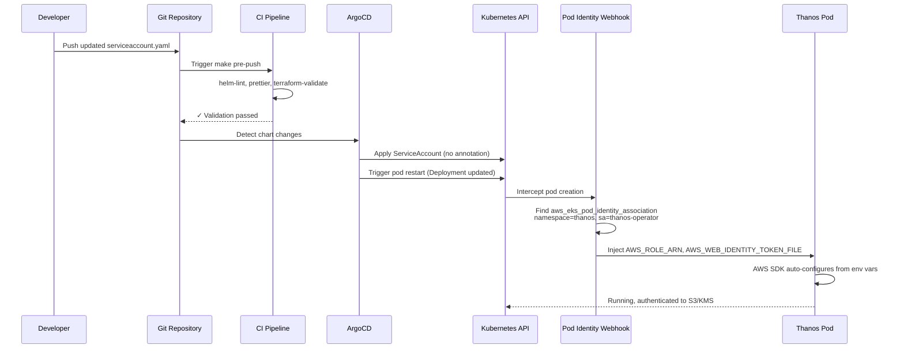

# Complete IRSA to EKS Pod Identity Migration

**Last Updated Date**: 2026-08-12

## Summary

This change completes the platform's migration from IRSA (IAM Roles for Service Accounts) to EKS Pod Identity by removing the last remaining IRSA annotation from the Thanos service account template. The infrastructure is already in place - Terraform has Pod Identity associations for all Thanos components. This is a cleanup task removing a stale annotation that's ignored by EKS when Pod Identity is active.

Additionally, this documents the platform-wide Pod Identity architecture and migration history, establishing Pod Identity as the single authentication mechanism for all AWS IAM workloads.

## Context

### Problem Statement

The platform has completed infrastructure migration to EKS Pod Identity, but one IRSA annotation remains in the Thanos Helm chart (`argocd/config/regional-cluster/thanos/templates/serviceaccount.yaml`). This annotation is:

- Stale: Pod Identity associations already exist in Terraform for all 5 Thanos service accounts
- Ignored: EKS gives precedence to Pod Identity when both mechanisms are configured
- Confusing: New developers may incorrectly assume IRSA is still the platform standard

The platform needs a single, documented authentication mechanism.

### Constraints

- Zero downtime: Thanos is a critical metrics ingestion and storage service
- No infrastructure changes: Pod Identity associations already exist and are functional
- ArgoCD-managed: Changes deploy via GitOps sync, not manual kubectl apply
- Must maintain credentials during pod restart

### Assumptions

- Terraform state for all regional clusters has `aws_eks_pod_identity_association` resources for Thanos
- ArgoCD auto-sync is enabled for the Thanos application
- Pod Identity Agent DaemonSet is running on all EKS nodes (EKS-managed, enabled by default)

### Migration History

The platform has migrated all controllers to Pod Identity:

| Date       | Component  | Commit   | Change                                     |
| ---------- | ---------- | -------- | ------------------------------------------ |
| 2026-08-12 | Karpenter  | 8b9a3661 | IRSA → Pod Identity, removed OIDC provider |
| 2026-08-12 | Thanos     | (this)   | Remove stale IRSA annotation               |
| Prior      | All others | Various  | 30+ Pod Identity associations across repos |

Controllers already using Pod Identity (non-exhaustive):

- Thanos (receiver, store, compact, ruler, ingester)
- Karpenter
- AWS Load Balancer Controller
- EBS CSI Driver
- kube-applier
- external-dns
- cert-manager
- Loki forwarder
- Prometheus remote write
- CloudWatch exporter
- Grafana CloudWatch logs
- ZOA jobs
- Platform API authz

## Architecture

### Current State

**Thanos Service Account:**

```yaml
# argocd/config/regional-cluster/thanos/templates/serviceaccount.yaml
apiVersion: v1
kind: ServiceAccount
metadata:
  name: thanos-operator
  namespace: thanos
  annotations:
    # STALE: Pod Identity is active, this annotation is ignored
    eks.amazonaws.com/role-arn: arn:aws:iam::123456789012:role/cluster-name-thanos
```

**Terraform (already correct):**

```hcl
# terraform/modules/thanos-infrastructure/main.tf
resource "aws_eks_pod_identity_association" "thanos_receiver" {
  cluster_name    = var.eks_cluster_name
  namespace       = "thanos"
  service_account = "thanos-operator"
  role_arn        = aws_iam_role.thanos_receiver.arn
}

# Plus 4 more associations for store, compact, ruler, ingester
```

**Authentication Behavior:**

EKS gives precedence to Pod Identity. When both IRSA annotation and Pod Identity association exist, the Pod Identity webhook injects credentials and the annotation is ignored. Thanos pods are already authenticating via Pod Identity.

### Target State

**Thanos Service Account (cleaned):**

```yaml
# argocd/config/regional-cluster/thanos/templates/serviceaccount.yaml
apiVersion: v1
kind: ServiceAccount
metadata:
  name: thanos-operator
  namespace: thanos
  annotations: {} # No IRSA annotation
```

**Terraform (unchanged):**

Pod Identity associations remain exactly as-is. No infrastructure changes.

**Authentication Behavior:**

Identical to current state. Pods authenticate via Pod Identity; no annotation needed.

### Component Changes

#### 1. Thanos Helm Chart

**File:** `argocd/config/regional-cluster/thanos/templates/serviceaccount.yaml`

**Change:** Remove lines 10-13 (conditional IRSA annotation block):

```diff
 metadata:
   name: {{ .Values.serviceAccount.name }}
   namespace: {{ include "thanos-operator.namespace" . }}
   annotations:
     {{- include "thanos-operator.annotations" . | nindent 4 }}
-    {{- if .Values.global.aws_account_id }}
-    {{- $partition := ternary "aws-us-gov" "aws" (hasPrefix "us-gov-" .Values.global.aws_region) }}
-    eks.amazonaws.com/role-arn: {{ printf "arn:%s:iam::%s:role/%s-thanos" $partition .Values.global.aws_account_id .Values.global.cluster_name | quote }}
-    {{- end }}
     {{- with .Values.serviceAccount.annotations }}
     {{- toYaml . | nindent 4 }}
     {{- end }}
```

**File:** `argocd/config/regional-cluster/thanos/values.yaml`

**Change:** None. Already has correct empty annotations:

```yaml
serviceAccount:
  name: thanos-operator
  annotations: {}
```

#### 2. Documentation

**New File:** `docs/design/pod-identity-migration.md`

**Content:**

- Platform Pod Identity architecture overview
- Why Pod Identity over IRSA (simpler Terraform, no OIDC provider, no annotation plumbing)
- Migration timeline (Karpenter, Thanos)
- Reference implementation examples
- Links to existing design docs (Karpenter, Thanos infrastructure)

## Data Flow

### Deployment Flow



### No Transition Period

- **Pod Identity associations already exist** in Terraform state
- **IRSA annotation is already ignored** (Pod Identity takes precedence when both exist)
- **Removing annotation doesn't change authentication behavior**
- **Zero downtime:** Pod restart picks up credentials from Pod Identity webhook as it already does today

### Credential Injection Flow (Post-Migration)

```mermaid
graph LR
    SA[ServiceAccount<br/>thanos-operator] -->|no annotation| PIA[Pod Identity Association<br/>Terraform resource]
    PIA -->|cluster_name, namespace, SA| Webhook[Pod Identity Webhook<br/>EKS-managed DaemonSet]
    Webhook -->|inject env vars| Pod[Thanos Pod]
    Pod -->|AWS SDK reads| Env[AWS_ROLE_ARN<br/>AWS_WEB_IDENTITY_TOKEN_FILE]
    Env -->|assume role| STS[AWS STS]
    STS -->|temporary creds| S3[S3 API<br/>thanos-metrics bucket]
```



## Error Handling

### Potential Failure Scenarios

#### 1. ArgoCD Sync Failure

**Scenario:** Helm chart validation fails during sync

**Detection:**

- ArgoCD Application shows degraded status
- Sync error visible in ArgoCD UI
- Alert fires if ArgoCD sync monitoring is configured

**Mitigation:**

- Pre-merge validation via `make pre-push` catches Helm lint errors
- CI enforces `helm-lint` passing before merge
- ArgoCD has automated rollback on sync failure (configurable)

**Rollback:**

```bash
argocd app rollback thanos <previous-revision>
# Or via UI: Applications → thanos → History → Rollback
```

#### 2. Pod Restart Fails to Acquire Credentials

**Scenario:** Pod Identity webhook fails to inject credentials after annotation removal

**Detection:**

- Pod logs show AWS SDK authentication errors
- Pod enters CrashLoopBackOff state
- Thanos metrics ingestion stops (gaps in Prometheus remote_write)

**Root Cause (unlikely):**

- Pod Identity association missing from Terraform state (accidentally destroyed)
- Pod Identity webhook not running (EKS control plane issue)

**Mitigation:**

Pre-deployment verification (documented in Testing section):

```bash
terraform state list | grep thanos.*pod_identity
# Must show 5 associations before proceeding
```

**Rollback:**

```bash
# Quick rollback via ArgoCD
argocd app rollback thanos <previous-revision>

# Or if association really is missing, re-apply Terraform
cd terraform/config/regional-cluster
terraform plan  # Verify association will be created
terraform apply
```

#### 3. Missing Pod Identity Association

**Scenario:** Terraform state doesn't have expected associations (destroyed accidentally, wrong cluster context)

**Detection:**

- Pre-deployment verification command fails
- No `aws_eks_pod_identity_association.thanos_*` resources in state

**Mitigation:**

- **MUST verify before removing annotation**
- Documented verification step in migration plan
- CI should not allow merge without confirmation

**Fix:**

```bash
cd terraform/config/regional-cluster
terraform plan  # Will show 5 Pod Identity associations to create
terraform apply
# Wait for Terraform to create associations
# Then proceed with annotation removal
```

### Validation Strategy

**Pre-Deployment (required):**

1. Verify Pod Identity associations exist in target cluster's Terraform state
2. Run `make pre-push` to validate Helm chart renders correctly
3. Check current ServiceAccount has IRSA annotation (to confirm what's being removed)

**Post-Deployment (monitoring):**

1. Verify ServiceAccount updated with no annotation
2. Confirm Pod Identity env vars injected (`AWS_ROLE_ARN`, `AWS_WEB_IDENTITY_TOKEN_FILE`)
3. Monitor Thanos operator logs for successful AWS API calls (S3, KMS)
4. Check Prometheus metrics for continued ingestion (no gaps)

**Rollback Plan:**

- Single commit = single logical change (easy `git revert`)
- ArgoCD tracks revision history
- Rollback via ArgoCD UI or CLI in <60 seconds

## Testing

### Pre-Deployment Verification

#### 1. Verify Pod Identity Associations Exist

```bash
# In regional-cluster Terraform directory
cd terraform/config/regional-cluster

# List all Thanos Pod Identity associations
terraform state list | grep "aws_eks_pod_identity_association.thanos"

# Expected output (5 associations):
# module.thanos_infrastructure.aws_eks_pod_identity_association.thanos_receiver
# module.thanos_infrastructure.aws_eks_pod_identity_association.thanos_store
# module.thanos_infrastructure.aws_eks_pod_identity_association.thanos_compact
# module.thanos_infrastructure.aws_eks_pod_identity_association.thanos_ruler
# module.thanos_infrastructure.aws_eks_pod_identity_association.thanos_receive_ingester

# If count != 5, STOP and investigate before proceeding
```

#### 2. Validate Helm Chart

```bash
# From repository root
make helm-lint

# Should pass with no errors
# Ensures chart renders correctly without IRSA annotation
```

#### 3. Check Current Annotation State

```bash
# Confirm IRSA annotation exists before removal
kubectl get serviceaccount thanos-operator -n thanos -o yaml | grep eks.amazonaws.com/role-arn

# Expected output:
# eks.amazonaws.com/role-arn: arn:aws:iam::123456789012:role/cluster-name-thanos
```

### Post-Deployment Validation

#### 1. Verify ServiceAccount Updated

```bash
# Confirm annotation removed
kubectl get serviceaccount thanos-operator -n thanos -o yaml

# Should have NO eks.amazonaws.com/role-arn annotation
# Only standard annotations (kubectl.kubernetes.io/*, etc.)
```

#### 2. Confirm Pod Identity Active

```bash
# Check for Pod Identity env var injection
kubectl get pods -n thanos -l app.kubernetes.io/name=thanos-operator -o yaml | grep "AWS_"

# Expected output (Pod Identity injection):
# - name: AWS_ROLE_ARN
#   value: arn:aws:iam::123456789012:role/cluster-name-thanos
# - name: AWS_WEB_IDENTITY_TOKEN_FILE
#   value: /var/run/secrets/pods.eks.amazonaws.com/serviceaccount/token
# - name: AWS_REGION
#   value: us-east-1
```

#### 3. Verify AWS API Access

```bash
# Check Thanos operator logs for successful S3/KMS operations
kubectl logs -n thanos -l app.kubernetes.io/name=thanos-operator --tail=50 | grep -i "s3\|kms\|error"

# Should show:
# - Successful S3 ListBucket, PutObject operations
# - No "AccessDenied", "InvalidAccessKeyId", or credential errors
```

#### 4. Monitor Metrics Ingestion

```bash
# Query Thanos for recent metrics (confirms write path working)
kubectl port-forward -n thanos svc/thanos-query 9090:9090

# In browser: http://localhost:9090/graph
# Run query: up{job="thanos-receive"}
# Should show recent timestamps (within last 5 minutes)
```

### Documentation Testing

```bash
# Validate markdown formatting
make check-docs

# Expected: prettier passes with no formatting errors
```

**Manual Checks:**

- Verify Mermaid diagrams render correctly in GitHub PR preview
- Check internal doc links resolve (click all `[text](file.md)` links)
- Confirm code blocks have correct syntax highlighting

### Rollback Test (Optional)

```bash
# Simulate rollback scenario
argocd app get thanos --output json | jq '.status.history[-2].id'
# Get previous revision ID

argocd app rollback thanos <previous-revision-id>

# Verify:
# - ServiceAccount has IRSA annotation again
# - Pods still authenticate successfully (Pod Identity still works)

# Re-deploy fix:
argocd app sync thanos
```

## Cross-Cutting Concerns

### Reliability

- **Zero Downtime:** Pod Identity injection happens during pod startup; credentials available before application code runs
- **Graceful Degradation:** If Pod Identity webhook fails, ArgoCD rollback restores previous state in <60s
- **Monitoring:** Standard pod restart metrics, ArgoCD sync status, Thanos ingestion metrics

### Security

- **Least Privilege:** Pod Identity associations scope roles to specific namespace + service account (tighter than IRSA's namespace-only scoping via OIDC audience)
- **No Annotation Injection:** IRSA required plumbing role ARN through Helm values (could be misconfigured); Pod Identity associations are declarative Terraform resources
- **Audit Trail:** All role assumptions logged to CloudTrail with pod identity (IRSA logged only IAM role ARN, not pod identity)

### Performance

- **Pod Startup Time:** Identical to current state (Pod Identity already active)
- **Token Refresh:** EKS Pod Identity Agent handles token rotation automatically (same as IRSA)

### Cost

- **No Change:** Pod Identity is a free EKS feature; no additional AWS charges

### Operability

- **Simpler Debugging:** `kubectl describe pod` shows Pod Identity env vars directly; no need to trace annotation → Helm values → Terraform outputs
- **Fewer Moving Parts:** Removed from Karpenter migration: OIDC provider, tls_certificate data source, tls provider, ECS env var, cluster secret annotation, ApplicationSet valuesObject injection
- **Declarative:** Pod Identity associations in Terraform state; visible in `terraform plan` diff

## Platform Pod Identity Architecture

### Design Principles

1. **Single Mechanism:** Pod Identity for all AWS IAM authentication; no IRSA
2. **Declarative Terraform:** All associations in `aws_eks_pod_identity_association` resources
3. **No Annotations:** Service accounts have no `eks.amazonaws.com/role-arn` annotations
4. **Module Ownership:** IAM roles and Pod Identity associations live in the same Terraform module (e.g., `thanos-infrastructure`, `kube-applier`, `authz`)

### Standard Pattern

Every module that needs AWS IAM follows this pattern:

```hcl
# 1. IAM role with Pod Identity trust policy
resource "aws_iam_role" "example" {
  name = "${var.cluster_id}-example"

  assume_role_policy = jsonencode({
    Version = "2012-10-17"
    Statement = [{
      Effect = "Allow"
      Principal = {
        Service = "pods.eks.amazonaws.com"
      }
      Action = [
        "sts:AssumeRole",
        "sts:TagSession"
      ]
    }]
  })
}

# 2. IAM role policy (permissions)
resource "aws_iam_role_policy" "example" {
  name = "example-permissions"
  role = aws_iam_role.example.id
  policy = jsonencode({
    # S3, KMS, SQS, etc.
  })
}

# 3. Pod Identity association (binding)
resource "aws_eks_pod_identity_association" "example" {
  cluster_name    = var.eks_cluster_name
  namespace       = "example-namespace"
  service_account = "example-sa"
  role_arn        = aws_iam_role.example.arn
}
```

**Service Account (Helm chart):**

```yaml
apiVersion: v1
kind: ServiceAccount
metadata:
  name: example-sa
  namespace: example-namespace
# NO annotations needed
```

### Migration Benefits (IRSA → Pod Identity)

| Aspect                   | IRSA                                                   | Pod Identity                                        |
| ------------------------ | ------------------------------------------------------ | --------------------------------------------------- |
| **Terraform**            | OIDC provider, tls_certificate, tls provider           | Just role + association                             |
| **Service Account**      | Annotation with role ARN                               | No annotation                                       |
| **Helm Values**          | Must inject role ARN from Terraform                    | No Helm values needed                               |
| **Trust Policy**         | Complex OIDC conditions (issuer, aud, sub)             | Simple `pods.eks.amazonaws.com`                     |
| **Debugging**            | Trace annotation → values → Terraform outputs → OIDC   | `kubectl describe pod` shows env vars               |
| **Pod Identity Visible** | Only in IAM role ARN                                   | Shows pod namespace, SA, cluster name in CloudTrail |
| **Scope**                | Namespace-level (any pod can use SA if annotation set) | Namespace + ServiceAccount                          |
| **Credential Location**  | Mounted token file (OIDC JWT)                          | Mounted token + env vars (AWS SDK auto-detects)     |

## Related Documentation

- [Karpenter Node Provisioning](../design/karpenter-node-provisioning.md) - Documents Karpenter's IRSA → Pod Identity migration (2026-08-12)
- [Thanos Metrics Infrastructure](../design/thanos-metrics-infrastructure.md) - Thanos architecture (if exists)
- [Regional OIDC Ownership](../design/regional-oidc-ownership.md) - Customer ROSA HCP cluster OIDC (different from platform IRSA)
- AWS Documentation:
  - [EKS Pod Identity](https://docs.aws.amazon.com/eks/latest/userguide/pod-identities.html)
  - [Migrate from IRSA to Pod Identity](https://docs.aws.amazon.com/eks/latest/userguide/pod-id-abac.html#pod-id-abac-migrate)
